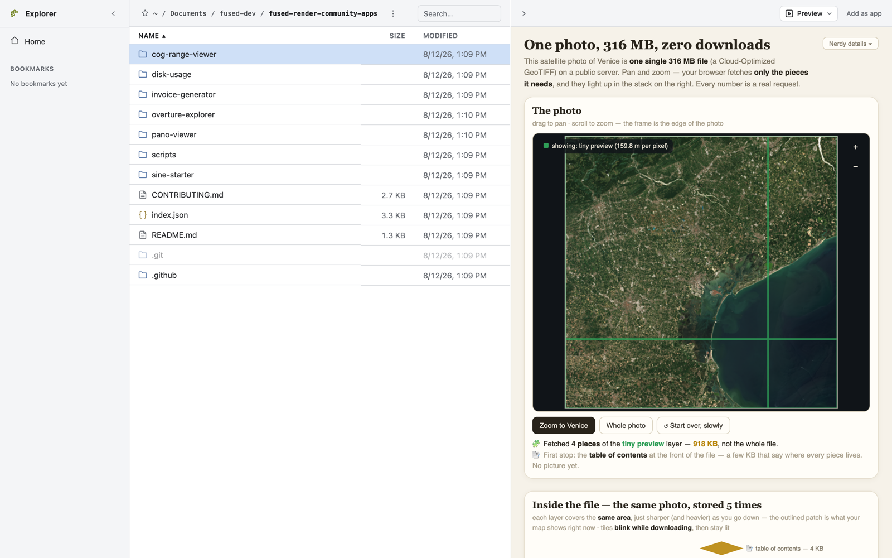
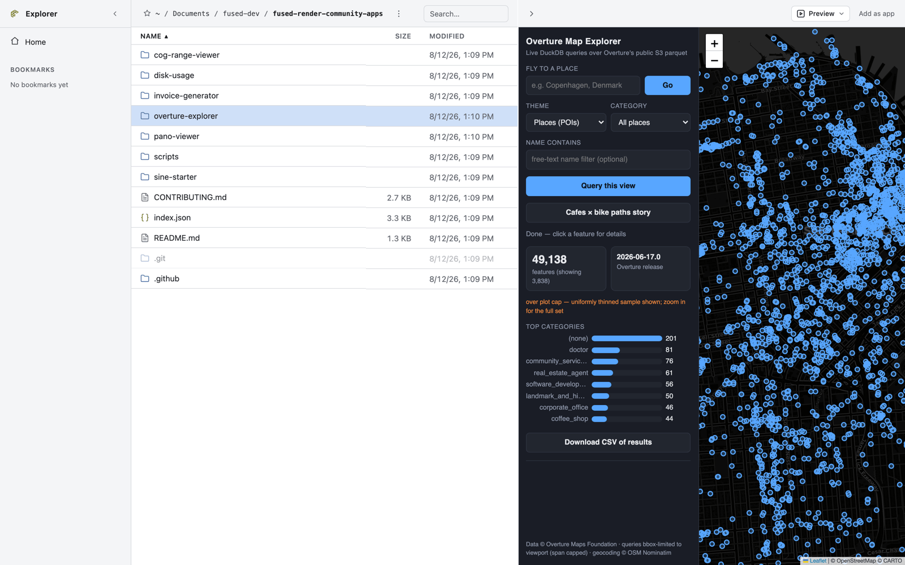
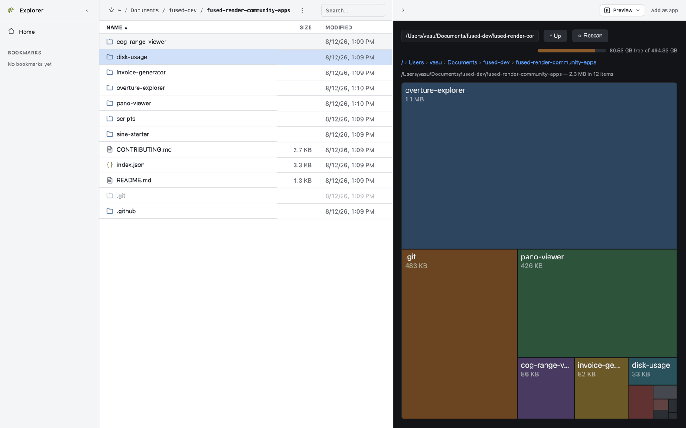
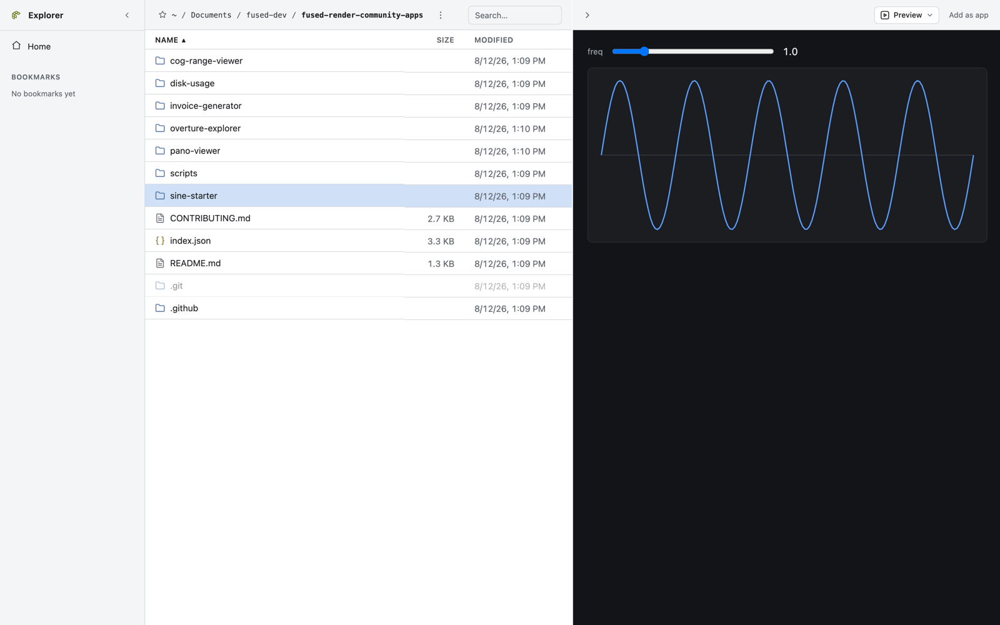

# fused-render community apps

A community marketplace of shared [fused-render](https://github.com/fusedio/fused-render)
apps. Every top-level folder is one app; the folder name is the app's slug and
its permanent identity.

Browse and install these from the **Community** page inside fused-render, or
copy any folder into `~/Documents/Fused/community/` by hand — an app is just
files.



## A few of the apps

| | |
|---|---|
|  |  |
|  | |

## App layout

```
<slug>/
├── index.html       # entry point (required, exactly one top-level .html)
├── readme.md        # shown in the marketplace detail view (required)
├── preview.png      # preview image (required)
├── metadata.json    # manifest (required — see CONTRIBUTING.md)
└── ...              # anything else: .py helpers, assets/, etc.
```

`index.json` at the repo root is generated by CI on every merge to `main` —
never edit it by hand. It is the entire catalog payload the marketplace
fetches.

## Publishing your app

Open a PR adding your app folder. See [CONTRIBUTING.md](CONTRIBUTING.md) for
the checklist; CI validates every submission and a maintainer reviews it.

## Trust

Apps in this repo run on the installing user's machine with the same trust as
their own files — including Python execution via `fused.runPython`. PR review
is the publishing gate. Report a problematic app by opening an issue.
