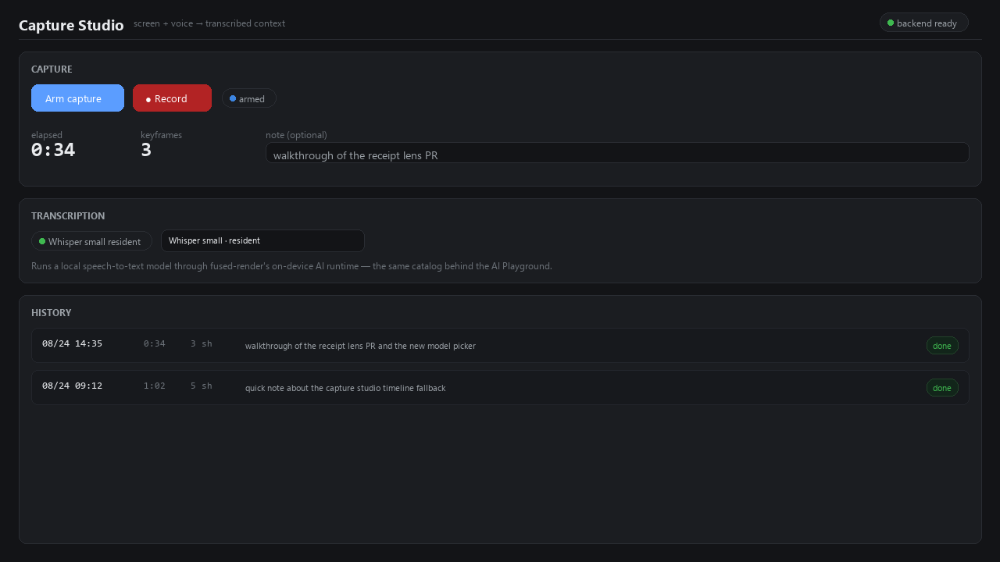

# Capture Studio



**Record your screen and voice, and get back a ready-made `context.md`** —
a full transcript matched to a timeline of keyframes, ready to paste into a
doc, a ticket, or a prompt. Everything happens on your machine.

## How to use it

1. **Arm** — picks a screen to share and asks for mic access. Keep talking
   and working; nothing is recorded yet.
2. **Record** — hold `Space` (push-to-talk) or click **● Record**. The page
   grabs a downscaled screenshot a few times a second, but only *keeps* one
   when the screen actually changed enough to matter (or roughly every 10s of
   continuous speech) — so a long silent capture costs almost nothing.
3. **Release** — stops recording, uploads the audio and up to 8 selected
   keyframes, and transcribes locally.
4. **History** — every capture is listed with its transcript preview; open
   one to see the keyframes and full transcript, or hit **Copy context** to
   grab the assembled markdown.

Pop the live waveform/timer out into a floating Picture-in-Picture pill
(where the browser supports it) so you can keep an eye on it while working
in another window.

## Local transcription, your choice of model

Transcription runs through fused-render's own on-device AI runtime —
`fused.ai.transcribe()` — the same local speech-to-text catalog behind the
**AI Playground** and the AI Models page. Pick a model from the dropdown in
the Transcription card (it downloads once and stays resident between
captures), or open this app directly from the AI Playground with a model
already selected. No custom model bundling, no separate download step —
this app declares `automatic-speech-recognition` in its `metadata.json`
specifically so the platform's own model management handles it.

## What's assembled

`context.md` looks like:

```markdown
# Capture 20260824-145523  (34.2s, 3 shots)

## Transcript
<full transcript text>

## Timeline
- 0:02 [shot-00.png] start — "…nearby words or sentences…"
- 0:12 [shot-01.png] scene-change — "…"

## Note
<your optional note>
```

Word-level timestamps (used to match the *exact* words spoken near each
keyframe) are only available on Apple Silicon today — `fused.ai.transcribe`'s
`words: true` option is best-effort and only the MLX Whisper engine produces
them. Everywhere else, the timeline falls back to whichever whole sentence
was spoken close to that moment — slightly coarser, still useful.

## Notes

- Nothing is uploaded anywhere — audio, screenshots, and transcripts stay in
  this app's own `sessions/` folder on your disk.
- First transcription with a given model downloads its weights — shown in
  the model dropdown before you start.
- No native `alert`/`confirm` dialogs anywhere; delete asks for confirmation
  in-page.
