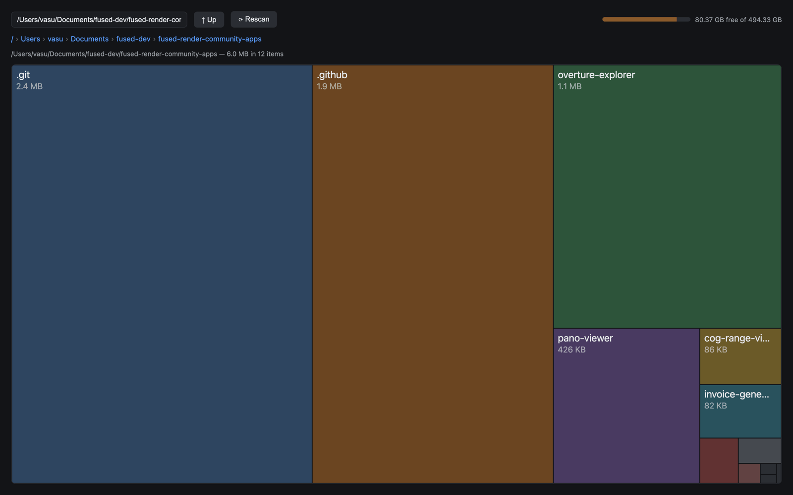

# Disk Space Visualizer

Find out what's eating your disk. Scans one directory level at a time
(`du`-based, fast even on big folders), shows subfolder and file sizes as
proportional bars, and lets you drill in, preview files, and delete.

- **Scan** starts at your home folder; click any subfolder to drill down.
- **Preview** shows metadata and a text head for files, top entries for dirs.
- **Delete is safe**: everything goes to `~/.Trash`, never a hard `rm`.

Backend is pure-stdlib Python (`disk.py`) called via `fused.runPython`.

> macOS/Linux use `du -kxd1`; Windows uses an equivalent `scandir` walk. Both
> trash to `~/.Trash` (never a hard `rm`).
