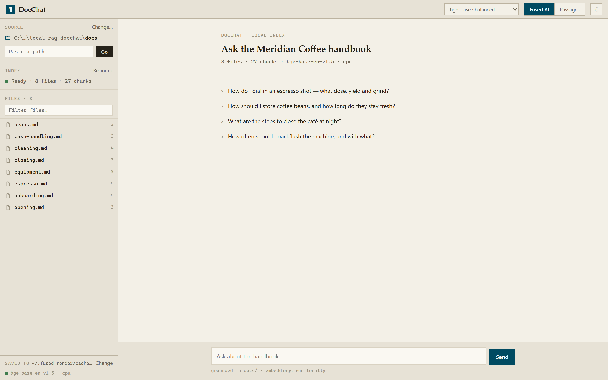

# DocChat

**Ask questions about any folder or file on your machine.** Point DocChat at a source and it indexes it locally, then answers your questions grounded in the content — citations included. **No cloud, no API key, no Ollama.**

- **Embeddings run on your machine** via [sentence-transformers](https://www.sbert.net/). Default model is `Qwen/Qwen3-Embedding-0.6B`; switch to `bge-base`, `bge-small`, or `bge-m3` from the header.
- **Vector store:** DuckDB + VSS (HNSW index, cosine metric) — embed once, search fast.
- **Answers:** the local Claude CLI via `fused.ai`, grounded in the retrieved chunks. Falls back to extractive passages if the CLI isn't present.
- **Incremental indexing:** editing one file only re-embeds that file, not the whole folder.

## How it works

1. `serve.py` is called once via `fused.runPython` to make sure the embedding server (`ragserver.py`) is running. The server binds to a fixed local port and stays warm across questions.
2. Choosing a source triggers indexing server-side (walk → chunk → embed → DuckDB + HNSW). Progress is reported live; indexing runs outside the 60 s `runPython` limit.
3. A question is embed-query → HNSW top-k — fast, never a re-walk.
4. The Fused AI backend writes a cited answer from the top chunks; Sources are collapsible and clicking a source opens the file in the preview pane.

## What gets stored

Everything lives under `~/.fused-render/cache/`:

- **Index:** `~/.fused-render/cache/docchat/` — one DuckDB file per `(folder, model)`. Relocatable from the sidebar.
- **Model weights:** `~/.fused-render/cache/models/` (`$HF_HOME`).

## Try it with the bundled handbook

The `docs/` folder is a small café-operations handbook. Example questions:

- *How do I dial in an espresso shot?*
- *How should I store coffee beans and how long do they stay fresh?*
- *What are the steps to close the café at night?*
- *How often should I backflush the machine, and with what?*

## Files

| File | Role |
|---|---|
| `index.html` | Chat UI: sidebar (source / index / file list), ledger transcript, file-preview pane |
| `serve.py` | Launcher — ensures `ragserver.py` is running, returns its port and auth token |
| `ragserver.py` | Warm embedding server: loads the model once, builds/holds DuckDB+HNSW indexes, serves `/health /status /browse /index /search /files /file /cached /movecache` |
| `rag_common.py` | Folder walking, chunking, HTML→text, DuckDB/VSS helpers, cache paths |
| `docs/` | 8 example markdown docs (default source) |
