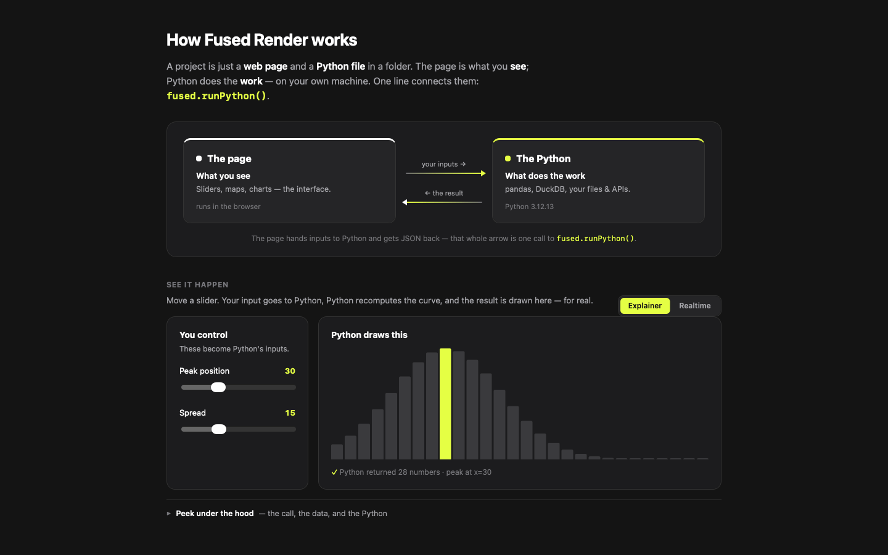

# How Fused Render works

The explainer that explains itself. A fused-render project is just a web page
and a Python file in a folder: the page is what you *see*, Python does the
*work* — on your own machine — and one call, `fused.runPython()`, is the whole
bridge between them.

This app draws that picture and then proves it, because the picture is running
on the very mechanism it describes.

## Using it

- **Move a slider.** Peak position and spread are the inputs. They travel to
  `demo.py`, Python recomputes the bell curve, and the bars redraw with the
  numbers that came back. The tallest bar lights up yellow.
- **Explainer / Realtime.** *Explainer* paces the round-trip into three visible
  phases — inputs travel out, the Python panel glows while it computes, the
  result travels back — so it reads clearly on a screen-share. *Realtime* drops
  every artificial delay and reports the true round-trip in milliseconds.
- **Peek under the hood** expands to show the exact `fused.runPython()` call the
  page just made, the URL the state is synced to, and the entire `demo.py`.

Both slider values and the mode live in `fused.params`, so they sync to the URL
— refresh or bookmark the page and the same state comes back.

The Python version printed under "The Python" is read from `platform` inside
`demo.py`. It is there as proof: that string could only have been produced by
real Python running locally.

## Requirements

- Python (`requires_python: true`) — standard library only (`math`,
  `platform`), no pip installs.
- Cross-platform. No network access, no API keys, no files read or written.

## Provenance

This was fused-render's bundled first-run tutorial (`examples_seed/how_it_works/`),
removed from the product in `d5ceadf8` so that first run starts on a clean
workspace. It is re-homed here so it is still one install away.
