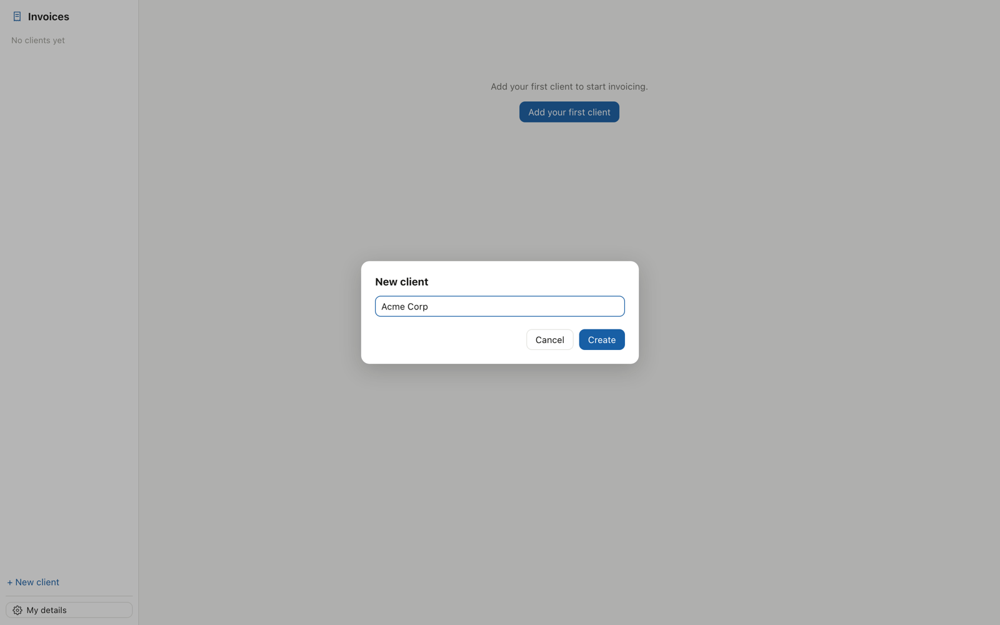

# Invoice Generator

A local invoice manager. Create clients, issue numbered invoices, track
status, and print. Nothing leaves your machine: every document is a plain
JSON file on disk, one invoice per file, grouped per client — readable,
diffable, yours.

- Client book with per-client invoice numbering.
- Invoice editor with line items, taxes, and FX reference rates.
- Print-ready invoice layout straight from the browser.
- Pure-stdlib Python backend (`invoice.py`) — no dependencies to install.
- Every backend action returns plain dicts, so an AI agent can drive the
  whole app headlessly exactly as the UI does.
