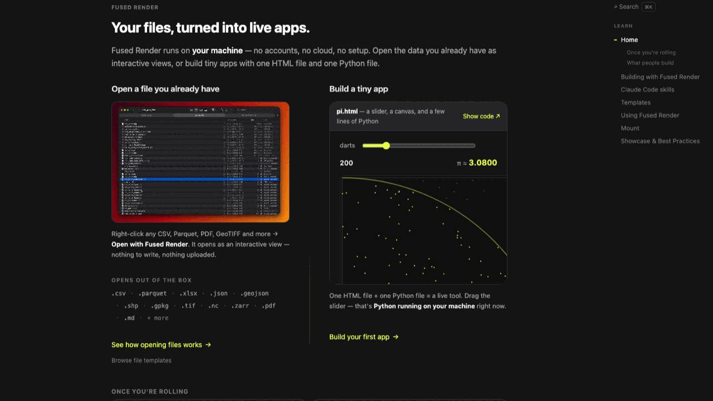

# Learn Fused Render

The Fused Render handbook, shipped as a Fused Render app. Seven pages of
documentation that don't just describe the authoring model — they run it, with
live embedded demos, real Python round-trips, and a `⌘K` search over every
heading.

## The pages

| Page | What's in it |
|---|---|
| **Home** | The two doors: open a file you already have, or build a tiny app. Includes a live `pi.html` embed — drag the slider and local Python recomputes the estimate. |
| **Building with Fused Render** | The mental model: HTML calls Python, state lives in the URL, `main()` is the whole contract. Ends with starter ideas. |
| **Claude Code skills** | The Claude Code integration and the skills that ship with it. |
| **Templates** | How opening a file picks a template, and how to register your own. |
| **Using Fused Render** | Bookmarks, split view, opening files with templates. |
| **Mount** | Browsing S3 and other remote buckets as if they were local folders. |
| **Showcase & Best Practices** | A gallery of what people build, each card deep-linking to its source. |

## How it uses Python

`requires_python: true`, and the calls are the demo — every one of them is
stdlib-only and read-only:

- `hello.py` — the minimal `main()` round-trip the page walks you through.
- `check_env.py` — reports whether the `claude` CLI is on your machine, so the
  Claude Code page tells you the truth about *your* setup.
- `check_libs.py` — lists the bundled Python version and the libraries your
  page code can import, read from `importlib.metadata` so it can't drift.
- `list_templates.py` — enumerates the core and custom templates actually
  installed here.
- `demo/pi.py` — throws darts to estimate pi; drives the live Home embed.

## Notes

- **Best opened inside Fused Render.** The live embeds and the machine-specific
  checks need the `fused` bridge; from a bare `file://` they degrade to labelled
  fallback placeholders rather than breaking.
- Page selection lives in the URL (`?page=build`), so every page and heading is
  bookmarkable and linkable.
- No network access and no API keys. Nothing is written to disk.

## Provenance and related apps

This is a copy of Fused Render's bundled **Learn** mount (`core_apps/learn/`),
re-homed here so it can be installed, edited, and kept as your own copy. The
one change from the bundled version: the `pi.html` demo moved into `demo/` to
satisfy the marketplace's one-top-level-`.html` rule.

For a shorter, single-mechanism explainer, see the **how-it-works** app — it
covers just the `fused.runPython()` bridge in depth.
