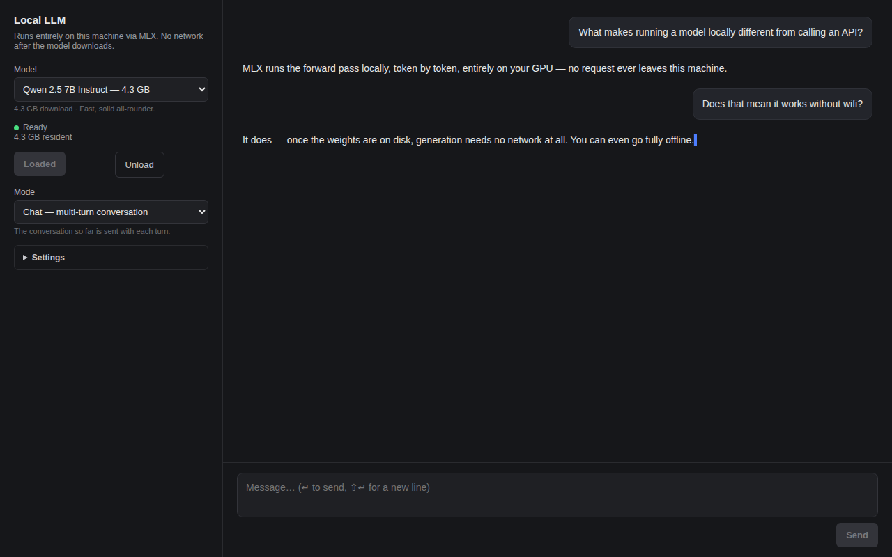

# Local Chat

**Chat with a language model that never leaves your machine.** Pick a model
from the curated shortlist (or anything you've already loaded from the AI
Models page), load it, and talk — no network round-trip after the weights are
on disk.

- **Chat or completion mode** — multi-turn conversation with a system prompt,
  or raw text continuation with no chat template.
- **Reasoning models** show their `<think>…</think>` narration in a collapsed
  fold above the answer, so the reply stays readable.
- **Settings** for temperature, max tokens, and system prompt, all persisted
  in the URL.
- The transcript is saved to disk (`chat.py`, stdlib only) so a reload shows
  yesterday's conversation.

The model itself is held resident by fused-render, not by this app — loading,
downloading progress, and unloading are all handled by the same `fused.ai`
runtime the AI Models page uses.
