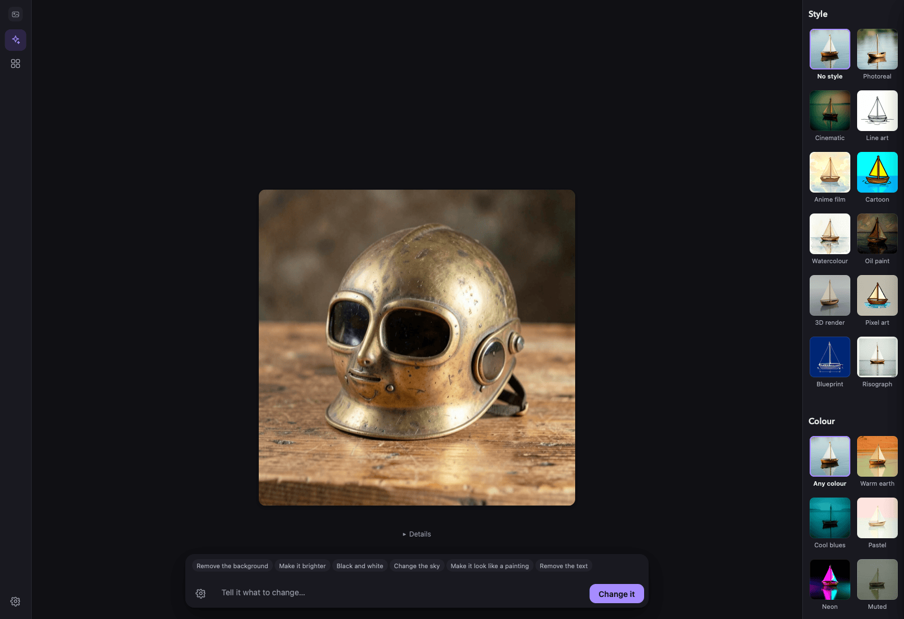

# Local Image

**Text-to-image with FLUX, generated entirely on your machine.** Describe a
picture, watch the render come together — no cloud API, no account, no key.
One workspace, one shared model:

## Workspace

Describe a picture, hit Generate, and it lands on the plate. Once it's there,
the same box becomes "Tell it what to change" — type an edit and hit Change it,
with undo/redo and a before/after slider over everything you've done. "Start
over" is the one way back to a blank plate. Drop a file, choose one, or use the
camera to start from a picture instead of a prompt. "Show me options" renders
a few takes on one prompt so you can pick a favourite; "Help me write this"
turns a rough idea into several ready-to-use prompts. A hairline traces the
plate's edge while a picture develops, and everything technical — model, seed,
steps, guidance, pixel size — lives behind one Advanced drawer, reachable from
the rail or from a gear on the prompt bar itself.

## Style and colour

A panel down the right-hand side carries two independent choices, each shown as
a picture rather than described in words: eleven **styles** (photoreal,
cinematic, line art, anime, cartoon, watercolour, oil paint, 3D render, pixel
art, blueprint, risograph) and seven **colour palettes** (warm earth, cool
blues, pastel, neon, muted, monochrome, or any colour at all). Every tile is a
real render of the same subject through that exact setting, committed to the
repo — so the tile shows you what the choice does before you spend a render on
it. Picking either appends its wording to your description; the two compose, so
a cartoon in cool blues is one click each. The panel is persistent on a roomy
window and folds into a toggle on a narrow one.

## Your pictures

Every picture you keep is saved to `./gallery/` as a PNG with a JSON sidecar.
This tab lists them, searches them, and lets you "Start from this" (reuse a
picture's settings for a fresh generate) or "Change it" (load the picture back
onto the workspace plate to keep editing). Backed by `gallery.py` — one of the
app's two Python files.

---

The model is curated and held resident by fused-render's `fused.ai.image(...)`
runtime, so loading, download progress, and unloading are shared with the rest
of the local-ai apps. Base-image edits always go through the mflux engine,
which is also the only engine that can change an existing picture at all.
