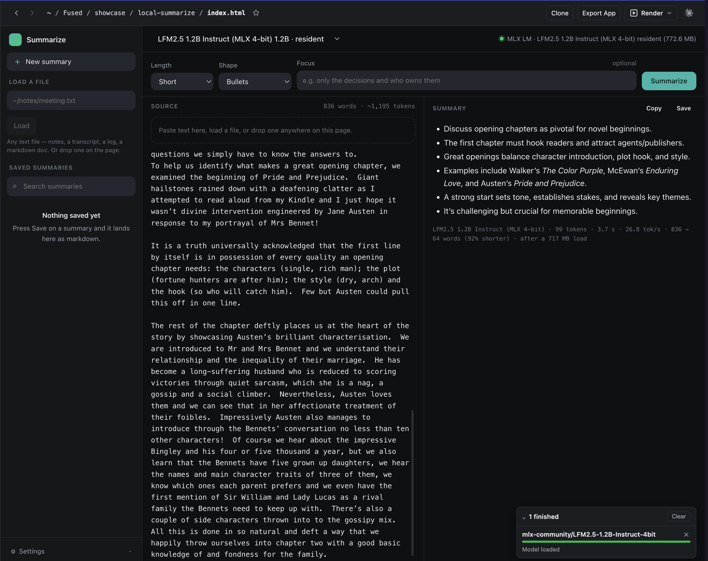

# Summarize



**Turn any text into a summary, with any text-generation model.** Paste it, load
a file, or drop one on the page; pick how long the summary should be and what
shape it should take; press Summarize and watch it arrive token by token.

- **Every text-generation model works** — the picker is read from
  fused-render's own catalog, so it lists the curated models, anything you have
  already downloaded from the AI Models page, and whatever is resident right
  now. Nothing is hardcoded, so it follows you across inference engines.
  Claude Haiku / Sonnet / Opus are offered alongside them through the Claude
  Code CLI, which means the app works on a machine with no weights on disk yet.
- **Long documents are summarized in two passes.** Text too long for the
  model's context is cut on paragraph boundaries into sections, each section is
  compressed into a digest, and the digests are summarized into the final
  answer. The digests stay on screen in a collapsed block — they are the record
  of what each part of the document actually said.
- **Shapes:** bullets, prose, a nested outline, a TL;DR, numbered key points,
  decisions and action items, or the open questions the text leaves behind.
- **Focus** narrows the summary to one thread — "only the decisions and who
  owns them", "just what changed since last week".
- **Stop** cancels a local generation mid-stream and keeps what arrived.
- Every setting lives in the URL, so a link restores the exact setup.

## Prompting

The model is told, in every call, to work only from the text it was given: no
added facts, no guessing at what the text "probably" means, the author's own
terminology and figures kept as written, and one line saying so if the text is
truncated or too short to summarize. The prompts are at the top of the script
section in `index.html`, in plain sight, because they are the app — everything
else is plumbing around three strings.

That is a discipline, not a guarantee. A summary is the model's reading of the
text, and a small local model reads less carefully than a large one. Check
anything that matters against the source pane, which is right there beside it.

## Saved summaries

Press Save and the summary is written as **markdown** — a small `---` header
this app writes, then the summary, then the section digests of a long document.
It opens and reads correctly in any markdown viewer with this app nowhere in
the picture, which is the point: the summary outlives the app that produced it.
The sidebar lists them, searches across their full text, reopens one in place,
and deletes the ones you are done with. Whatever is on screen is also
autosaved, so closing the tab mid-thought loses nothing.

They are kept in the machine's per-app cache drawer, not inside the app folder:

```
<fused-render home>/cache/<app slug>/
```

which on a default install is `~/.fused-render/cache/local-summarize/`. The
sidebar's Settings drawer prints the resolved path. Keeping them out of the app
folder means an app installed read-only can still save, and updating or
reinstalling the app never touches your summaries.

`source.py` loads and measures files and cuts them into sections; `saved.py`
resolves that folder, then lists, reads and deletes the library. Both are
standard-library Python — no `pyproject.toml`, so nothing to install and no
first-run wait.

## How the model is managed

The model is held resident by fused-render, not by this app: loading, download
progress, and unloading all go through the same `fused.ai` runtime the AI
Models page uses. Ask the catalog, don't hardcode — if you have already loaded
a model elsewhere, this app picks it up. The strip at the top right says what
the first run will actually cost: a load off disk, or a multi-gigabyte fetch.
