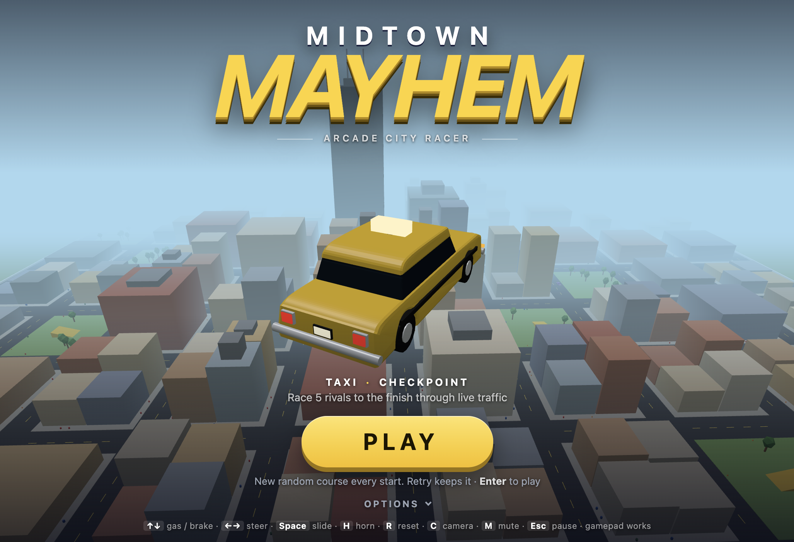

# Midtown Mayhem

An arcade city racer made in tribute to Microsoft's *Midtown Madness* (1999). You play solo, and the city
is full of AI that drives the same streets you do: rival racers, rival robbers, traffic and cops.

Plain ES modules plus a vendored three.js (`vendor/three.module.js`, r170). No build step, no assets,
no Python. The city, cars, props and sound are all generated in code (about 1,200 lines in `src/`).

## Modes

| Mode | What you do |
| --- | --- |
| Checkpoint | Race 5 rivals through 6 random checkpoints with traffic and cops live |
| Blitz | Hit 7 checkpoints in **any order** before the clock runs out (route planning on the minimap) |
| Circuit | 3 laps around a loop of blocks, no traffic or cops |
| Cops & Robbers | Solo vs an AI gang: grab the gold, take it home, ram the carrier to steal it. First to 3 |
| Cruise | Free roam. Score big air off park ramps, smashed props and close calls |

City options (from MM2, which reviewers liked): traffic, cop density, time of day, rival difficulty.
Five classic cars with real trade-offs (60s bug, checker cab, fastback muscle car, long-hood sports coupe,
50s step-van); traffic is a mix of finned 50s sedans, boxy 80s sedans and wagons, cops drive black-and-whites.
The title screen is one PLAY button (Enter works too) with mode, car and city settings behind Options.

## What the reviews asked for, and what we did

| Criticism of the original | Here |
| --- | --- |
| Keyboard steering is "all or nothing", easy to oversteer | Steering eases in and snaps back, and max lock drops with speed. Analog stick and triggers are supported |
| Cops are "moving obstacles" | Cops spot you speeding or hitting them, chase with sirens, predict your path, ram, and **bust** you if you stop near them (+10 s). Escape to lose them |
| Traffic "drives without noticing you" | Traffic brakes for anyone ahead, you included, and pulls over when you honk (H) |
| AI opponents cluster together and crash | Each rival has its own lane, pace and route choices. They overtake instead of queueing, and back out or respawn when stuck. Catch-up is gentle and capped by difficulty |
| Cops & Robbers gold always spawns in the same few places | The gold spawns somewhere new each time, at a fair distance from both hideouts |
| Few events | Every start generates a new random course. "Retry" keeps the course, and records are kept per course |
| Getting stuck or wrecked ends the fun | R puts you back on the road at any time. A wreck respawns you instead of ending the race |
| Choppy frame rate | Instanced city (a handful of draw calls), no shadows, fog-limited view, fixed 60 Hz physics |

## Controls

Arrows/WASD drive · Space handbrake · H horn · R back on road · C camera (chase, far, hood) · M mute · Esc pause.
Gamepad: RT/LT gas/brake, stick steer, A handbrake, B horn, Y reset, LB/RB camera, Start pause.

## Layout

- `src/city.js`: grid city, ramps, props, collision queries
- `src/car.js`: arcade car physics (forward speed plus lateral slip), car-car impulses, and the car bodies:
  side profiles extruded across the width with rounded edges, cached per model, three draw calls per car
- `src/ai.js`: lane following, greedy routing, overtaking, chasing, unsticking
- `src/main.js`: modes, cops and heat, input, camera, menu and loop
- `src/hud.js`, `src/audio.js`: HUD plus minimap, and a WebAudio engine, siren, horn and crashes
