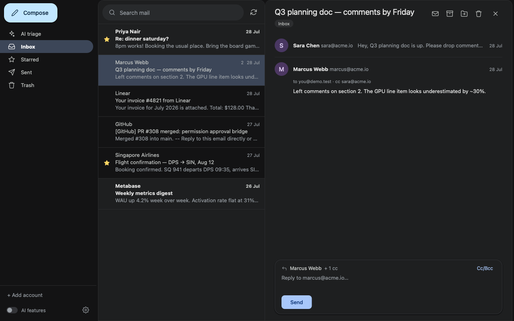

# OpenMail



A real multi-account mail client that runs entirely on your machine — thread
list, reading pane, compose / send / reply, archive, trash, star, mark unread,
labels, attachments, and full Gmail search syntax. Your mail never passes
through anyone's server: the app talks straight from your laptop to Gmail.

On top of the mailbox sits an **AI layer** powered by fused-render's local model
runtime (`fused.ai`), off by default:

- **Catch-up briefing** — when no thread is selected, the reading pane
  summarises everything unread as one clickable bullet per thread, cached
  against the exact unread set so revisiting it costs nothing.
- **Thread summary and suggested reply** on any open thread.
- **Triage board** (the Manage view, `triage.js`) — sorts the inbox into your
  own categories. Nothing moves until you approve it.

The UI is deliberately Gmail-shaped, ships light and dark themes (remembered in
`localStorage`, applied before first paint), and stays usable down to ~440px —
the sidebar folds to an icon rail at 900px, one pane at a time below 620px.

## Open it

Open `index.html` in fused-render. **The app needs the builtin (local) Python
engine** — start the server with `FUSED_RENDER_ENGINE=builtin`. `mail.py`
deliberately ships a bare `main()` with no `@fused.udf` decorator, because a
mail client owns local token files and spawns a local OAuth browser flow; a
remote UDF environment has neither.

With nothing connected you land on a welcome card with a single **Connect
Gmail** button. To browse the UI with **no credentials at all**, open the app
with `?account=demo` — a built-in fixture mailbox with six threads that
exercises every flow (its state lives in `~/.fused-mail/demo_state.json`;
delete that file to reset it). `?onboarding=1` forces the welcome card.

## Requirements

- fused-render with the **builtin** Python engine.
- `google-api-python-client` and `google-auth-oauthlib` in the server's Python
  environment (only for the OAuth path; the IMAP path needs neither).
- Network access to Gmail (`googleapis.com`, or `imap.gmail.com` /
  `smtp.gmail.com`).
- A locally resident model for the AI features (`fused.ai`). Without one the
  mailbox works fine; the AI panes just stay empty.

## Connect an account — path A: app password (~1 min)

1. Visit `myaccount.google.com/apppasswords` (needs 2-step verification on the
   account) and create an app password. Copy the 16 characters.
2. In the app: **+ Add account** → paste email + app password → Connect.

Runs over IMAP/SMTP using Gmail's extensions (`X-GM-THRID` threads,
`X-GM-LABELS` label ops, `X-GM-RAW` full Gmail search syntax), so
threads/labels/search/triage all work. Trade-offs vs the API path: no snippets
in the thread list, thread grouping over the newest ~100 messages per folder,
no pagination — and Google is slowly phasing app passwords out.

## Connect an account — path B: your own OAuth client (~10 min, full fidelity)

1. `console.cloud.google.com` → create or pick a project.
2. **APIs & Services → Library** → enable **Gmail API**.
3. **OAuth consent screen** → Internal (Workspace), or External plus yourself
   as a test user.
4. **Credentials → Create credentials → OAuth client ID** → application type
   **Desktop app**.
5. Download the client JSON and save it as `~/.fused-mail/credentials.json`.

Then click **+ Add account**. A Google consent window opens in your browser;
approve it and the account appears. Repeat for as many accounts as you like —
one token per account under `~/.fused-mail/tokens/`, all sharing your one
OAuth client. The scope requested is `gmail.modify` (read / send / labels — no
delete-forever, no settings changes).

No OAuth client ships with this app, on purpose: a shared client would put
someone else's app name on your consent screen, draw on their quota, and break
every install at once if it were ever suspended. If you do want to bundle one
for a trusted internal group, drop a `credentials.json` next to `mail.py` —
`mail.py` prefers `~/.fused-mail/credentials.json` and falls back to that file.
Never commit it.

### Gotchas that cost real time (2026 Google console)

- **Publish the app to production** once it works. While publishing status is
  `Testing`, Google expires refresh tokens after **7 days**, so every account
  re-consents weekly. In production (even unverified) the token persists; you
  click through one "Google hasn't verified this app" → *Advanced* → *Go to …*
  screen.
- While in Testing mode, test users must be saved on the Audience page
  **before** consent, or Google returns `403 access_denied` even for the
  project owner. The chip field needs a real click + Enter.
- The scope must also be declared under **Data Access** (`Manually add scopes`
  → `https://www.googleapis.com/auth/gmail.modify` → Add to table → Save).
- Consent must be completed in a normal browser profile; a fresh automated
  profile is refused with "This browser or app may not be secure".

## Where your data lives

Everything is written under `~/.fused-mail/` — nothing is ever written inside
the app folder.

```
~/.fused-mail/
├── credentials.json      OAuth client (you provide, once — optional)
├── accounts.json         registered accounts
├── tokens/<email>.json   per-account refresh token or app password
├── cache/                cached thread lists and messages
├── downloads/            attachment downloads
├── manage_config.json    triage categories
├── auth_status.json      add-account progress
├── auth.log              OAuth worker log
└── demo_state.json       demo mailbox state
```

Tokens are minted to you and stay on your machine. Deleting an account from the
sidebar also deletes its token, its cache, and any AI-derived content.

## Files

| File | Role |
|---|---|
| `index.html` | UI. State (account / label / query / thread) lives in URL params, so a refresh restores exactly where you were. |
| `mail.css` | Themes and layout. |
| `mail.py` | Every data op behind one bare `main(op=…)` dispatcher. |
| `triage.js` | The AI triage board (Manage view). |
| `add_account.py` | Detached OAuth consent worker — spawned by `op=start_auth` because interactive consent outlives the engine's call budget. |
| `vendor_imaplib.py` | Vendored CPython `imaplib`, for app bundles whose pruned stdlib omits it. |
| `tests/` | Two Playwright e2e suites that run against the demo mailbox only. |

## Limitations

- Gmail only. Outlook / generic IMAP hosts would need another adapter (the IMAP
  path is a reasonable starting point).
- There is no true one-click Gmail connect; every route ends at a Google consent
  screen, and this app deliberately uses *your* OAuth client rather than a
  hosted one.
- No delete-forever, no settings changes, no filters/rules editing.
- AI features make real local model calls and can take a while on a big inbox.

## Running the tests

Both suites drive the demo mailbox only, so they never touch real mail:

```
bunx playwright install chromium
rm -f ~/.fused-mail/demo_state.json && rm -rf ~/.fused-mail/cache/demo
PORT=8865 node tests/e2e-mailbox.js
PORT=8865 node tests/e2e-ai.js      # STALE — see the note at the top of the file
```

`e2e-mailbox.js` passes 22/22. `e2e-ai.js` is stale: its AI-off assertions pass,
then it aborts on a briefing control this version of the app doesn't have.

`PLAYWRIGHT_MODULE`, `CHROMIUM_PATH`, and `APP_PATH` override module, browser
binary, and app location if the defaults don't suit your setup.
