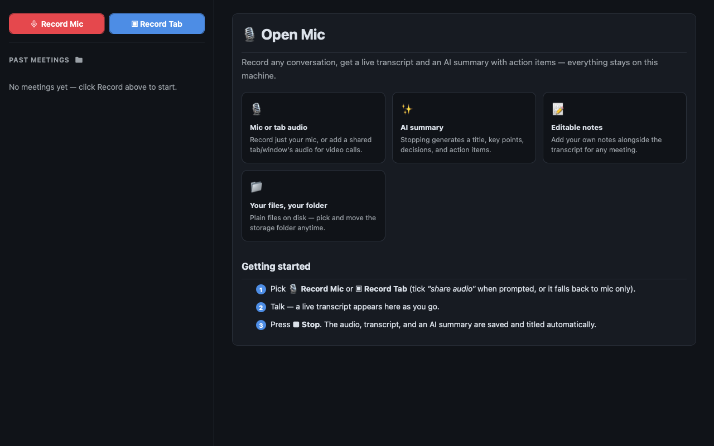

# OpenMic



A meeting recorder that never leaves your machine. Hit record, talk, hit stop —
OpenMic saves the audio, a transcript, an AI-written title, and a structured
summary with key points, decisions, and action items. Every meeting is a plain
folder of files you can open, edit, grep, or sync yourself.

## Recording

Two buttons, two modes:

- **🎙 Record Mic** — your microphone only. Good for voice memos and in-person
  conversations.
- **▣ Record Tab** — your microphone *plus* the audio of a tab, window, or
  screen you pick. Use this for video calls. Tick **"share audio"** in the
  browser's picker; if you don't (or your browser doesn't support it), the
  recording quietly falls back to mic-only and the card says so.

While recording, a live transcript streams into the main pane and a timer runs
in the header. Press **■ Stop** and the UI hands control straight back — you can
start a new recording immediately while the previous one's title and summary
finish generating in the background.

## How a recording is stored

Audio is written **incrementally**, not buffered in memory: the page's
`MediaRecorder` emits WebM chunks every few seconds, and each chunk is
base64-encoded and appended to `audio.webm` by `meetings.py`
(`action: "append_audio"`). A long meeting therefore costs no more browser
memory than a short one, and a crash mid-meeting leaves a playable file of
everything recorded up to that point.

In tab mode the mic and tab audio tracks are mixed through a Web Audio
`MediaStreamDestination` before they reach the recorder, so a single mixed
track lands on disk. Live transcription always listens to the raw mic stream
(the browser's speech engine can't be pointed at a custom stream).

Each meeting is a directory:

```
<meeting-id>/
├── meta.json       # title, start time, duration
├── audio.webm      # the recording
├── transcript.md   # what was said
├── summary.md      # AI summary, key points, decisions, action items
└── notes.md        # yours to edit, in the Notes tab
```

## Where your data lives

    ~/.fused-render/cache/open-mic/

`config.json` there holds the meetings root, which defaults to
`~/.fused-render/cache/open-mic/meetings/`. Click the folder icon next to
**Past Meetings** to move the whole store somewhere else (iCloud, a synced
Documents folder, an external drive) — the app moves the existing meetings and
remembers the new location. Set `OPEN_MIC_CACHE_DIR` to relocate the config
directory itself. Nothing is ever written inside the app folder.

Meetings recorded by a pre-1.0 build under `~/.fused-render/cache/openmic/`
are migrated to the new directory name on first run.

## Requirements

- A browser with `MediaRecorder` and the Web Speech API — Chrome or Edge.
  Safari and Firefox will record audio but produce no live transcript.
- `requires_python: true` — `meetings.py` handles all file IO. No third-party
  Python packages.
- A local model loaded in fused-render, used through `fused.ai(...)` for the
  title and the summary. No API keys, no remote AI service.

## Limitations

- **Live transcription uses the browser's speech engine.** In Chrome that
  means audio is sent to Google's speech service for recognition — the only
  part of OpenMic that is not on-device. The recording, the summary, and every
  file stay local.
- Speaker labels are a heuristic (pause- and pitch-based), not real
  diarization. Expect "Speaker 1 / Speaker 2" to drift in a crowded call.
- Tab audio depends on `getDisplayMedia` audio capture, which some
  browser/OS combinations do not offer at all.
- Very long transcripts are truncated before being sent to the model (8k
  characters for the title, 24k for the summary).
- Nothing is uploaded, and nothing is deleted unless you delete it.
