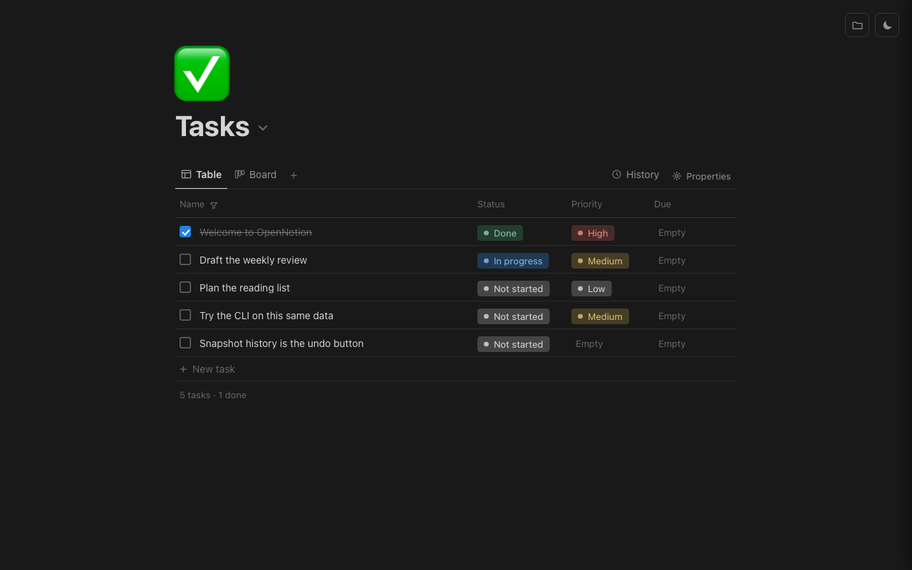

# OpenNotion



A notes-and-tasks board backed by a tiny local document store. Rows carry a
title, status, priority and due date; open a row and it becomes a page you
can write notes in. Everything lives in plain parquet files on your own
disk — no account, no server, no network.

The interesting part is the storage model ("duckLake"): a table is a folder
of full-state parquet snapshots, and **every write appends a new timestamped
snapshot instead of mutating anything**. So the table's whole history is on
disk and any past state can be read back.

## Using it

- Click **+ New** to add a row; click a row to open its notes page.
- The status and priority chips filter and group the board.
- The table menu (the table name in the header) lets you create, rename and
  switch tables, browse snapshot history, and **move the lake** to another
  folder — the move relocates every table and every snapshot, and is
  remembered for next time.
- Notes accept light markdown: `#`, `##`, `-`, `1.`, `[ ]`, `>`.

The `?table=` URL parameter selects the table, so a board can be bookmarked.

## The CLI

`lakectl.py` drives the same store from a terminal, which makes the app
scriptable (and pleasant to hand to an agent):

```
python3 lakectl.py tables
python3 lakectl.py rows tasks
python3 lakectl.py add tasks --set title="Ship the demo" --set status=prog
python3 lakectl.py history tasks
python3 lakectl.py export tasks > backup.json
```

Anything done there shows up in the UI on reload, and vice versa. Run
`python3 lakectl.py --help` for the full command list.

## Where your data is stored

Nothing is ever written inside the app folder. The lake lives at:

```
~/.fused-render/cache/open-notion/lake/
```

- Set `OPEN_NOTION_CACHE_DIR` to put the whole cache dir somewhere else.
- If you relocate the lake from the UI, the chosen path is remembered in
  `~/.fused-render/cache/open-notion/lake_location.json`.
- On first run the lake is created and seeded with the demo rows in this
  app's `seed/` folder. Delete them and they stay deleted — seeding only
  happens when there is no lake dir at all.

## Requirements

- `requires_python: true` — the UI calls `fused.runPython("./tasks_db.py")`.
- A parquet backend in the Python environment: **pyarrow**, or **duckdb** as
  a fallback (the app prefers pyarrow, which the fused-render runtime
  bundles). `pyproject.toml` lists both for running the CLI locally.
- No network access, no credentials, no external binaries.

## Limitations

- Snapshots are full copies of the table, so a very large table gets
  expensive to write and accumulates files. This is built for personal-scale
  notes (hundreds to a few thousand rows), not a warehouse.
- There is no compaction or snapshot pruning; old snapshots stay forever
  until you delete files yourself.
- No concurrency control: two writers at once means last-write-wins on the
  next snapshot.
- Every value is stored as a string; there are no typed columns.
