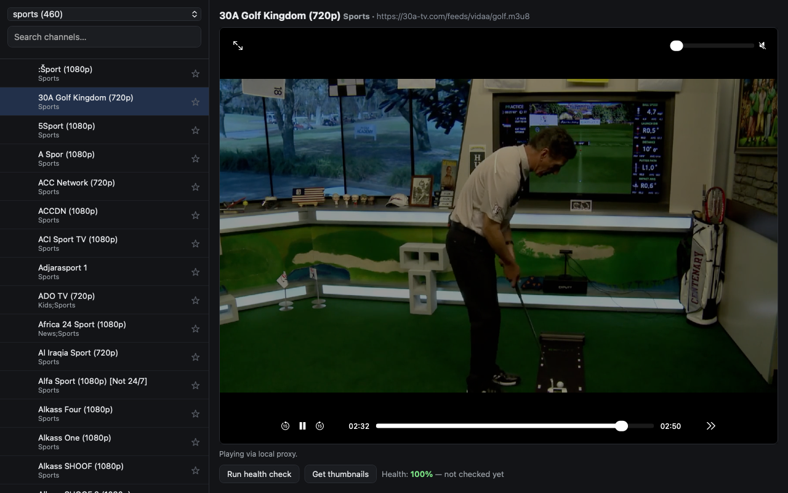

# OpenTV



A desktop IPTV player. OpenTV pulls the public
[iptv-org](https://github.com/iptv-org/iptv) playlists, lists the channels in a
searchable sidebar, and plays the selected stream in-page with
[hls.js](https://github.com/video-dev/hls.js). Because public IPTV streams are
a graveyard of dead links, it also keeps score: a background health checker
probes every URL in a category and remembers which ones keep failing, and a
thumbnail grabber pulls one real frame per channel so you can see what's
actually on before you click.

## Using it

1. **Start the proxy** (see below) — most streams won't play without it.
2. Pick a category from the dropdown (`sports` by default; ~30 categories,
   plus `all`). The playlist is fetched once and cached for 24 hours.
3. Type in the search box to filter, click a channel to play.
4. Click the star on a channel to favorite it; the `favorites` category lists
   everything you've starred.
5. **Run health check** probes every stream in the current category
   concurrently and streams live progress into the sidebar. Failures are
   remembered across runs, so a channel that fails repeatedly gets a visible
   fail percentage.
6. **Get thumbnails** grabs one frame per channel with ffmpeg (skipping
   channels that have never once responded) and shows them in the list.

Both background jobs run in a detached worker process, so you can keep
watching — or close the page — while they finish, and cancel at any time.

## The local proxy (required for playback)

Public IPTV streams are served from arbitrary hosts with no CORS headers, and
many are plain HTTP. A browser refuses both. `proxy.py` is a small stdlib-only
HTTP proxy that fetches streams server-side, adds
`Access-Control-Allow-Origin: *`, and rewrites playlist URIs so segments and
AES keys go through it too.

**OpenTV does not start the proxy for you.** Launch it by hand from the app
folder before playing anything:

```
python3 proxy.py     # listens on http://127.0.0.1:8787
```

Leave it running. OpenTV first tries to load each stream directly and only
falls back to the proxy, so a few streams work without it — but most don't. If
the proxy isn't running you'll see "Local proxy isn't running" in the status
line. Port `8787` is hardcoded in `index.html`, `proxy.py`, and
`thumbnails.py`; change it in all three if it clashes with something else.

## Requirements

- **Network access.** Playlists come from `iptv-org.github.io`, streams from
  whatever hosts the playlists point at, hls.js from a CDN. Channel logos are
  loaded from the URLs in the playlist.
- **ffmpeg on `PATH`** — only for the "Get thumbnails" job. Everything else
  works without it. Install with `brew install ffmpeg` (macOS) or
  `sudo apt install ffmpeg` (Debian/Ubuntu). If it's missing, the thumbnail
  job stops immediately with a message saying so.
- **Python with `pyarrow`** for the health-stats parquet file. fused-render
  installs it from `pyproject.toml`.
- No accounts, credentials, or API keys.

## Where OpenTV stores its data

Everything it writes lives outside the app folder, under:

```
~/.fused-render/cache/open-tv/
├── playlists/       # cached .m3u files + category counts (24h TTL)
├── <md5>.jpg        # one thumbnail per channel URL
├── favorites.json   # starred channels
├── health.parquet   # per-channel tries / fails / last result
└── runs/<run_id>/   # background job event logs
```

Set `OPEN_TV_CACHE_DIR` to put it somewhere else. Deleting the directory just
costs you your favorites and health history — everything else refetches. A
full-category thumbnail run over `all` can grow to a few hundred MB of JPEGs.

## Limitations

- Stream quality is entirely out of OpenTV's hands. Public IPTV links die,
  move, rate-limit, and geo-block constantly; a channel that worked yesterday
  may be gone today. That's what the health tracking is for.
- Only HLS (`.m3u8`) streams play. Playlist entries pointing at other
  protocols will fail.
- The proxy is unauthenticated and will fetch any `http(s)` URL handed to it.
  It binds to `127.0.0.1` only, but don't expose that port.
- Health checks and thumbnail grabs are network-heavy — 128 concurrent probes.
  Running one over the `all` category takes a while and is not gentle on your
  connection.
- OpenTV neither hosts nor rehosts any stream; it reads a public playlist and
  plays the URLs in it. Whether a given channel is licensed for you to watch
  is between you and its operator.
