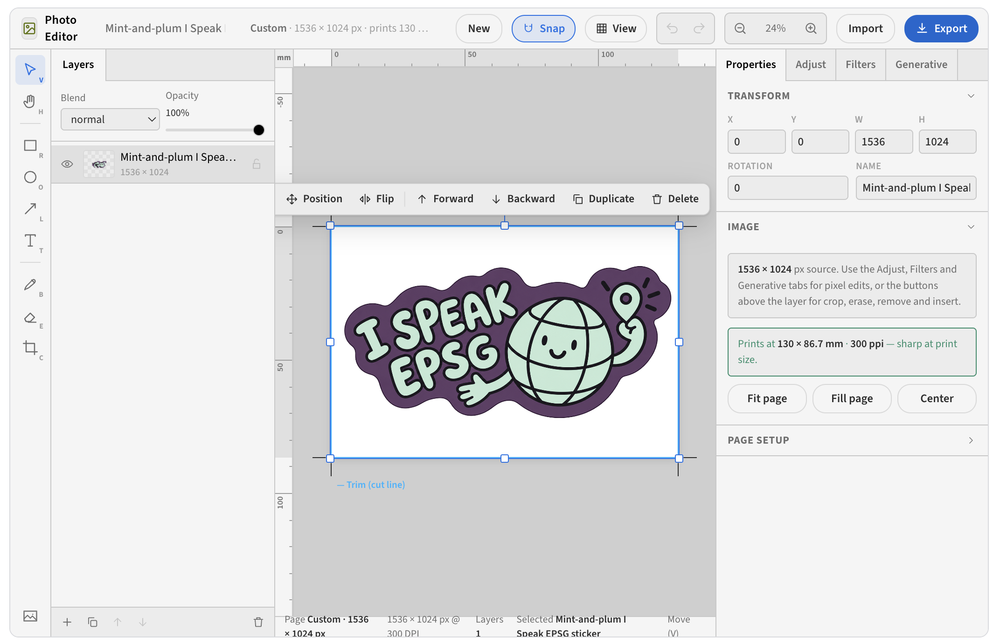

# Photo Editor

A local, Canva-inspired photo editor. Every pixel stays on this Mac:
generative Remove / Insert runs FLUX.2 Klein through fused-render's own
`fused.ai.image`, click-to-select runs SAM 2.1 on MLX, upscaling runs SeedVR2 3B
on MLX, and background removal uses macOS's own Vision framework. Nothing is
uploaded, and model weights are only downloaded when you press **Download** in
the panel that needs them.



> **Apple Silicon + macOS 14 only.** The AI tools need several GB of model
> weights from Hugging Face; each panel shows what is missing and offers a
> Download button (see [Requirements](#requirements)). The page also loads
> Konva and its fonts from public CDNs (unpkg, Google Fonts).

## What it does

| Tool | How it works |
|---|---|
| **Upload** | Drop a photo anywhere on the canvas. EXIF rotation is baked in on import so masks always line up. |
| **Adjust** | Ten sliders (brightness, contrast, saturation, temperature, tint, highlights, shadows, sharpness, vignette, blur). Live CSS preview, then baked into pixels with Pillow. |
| **Filters** | Seven presets with an intensity slider. |
| **Crop** | Freeform plus the usual ratios. |
| **Remove / Insert** | Paint a mask (smart select / brush / lasso / box / eraser) with brush-size, feather and expand/contract controls, optionally describe the change, press Remove or Generate. Runs a local image-edit model through `fused.ai.image` (FLUX.2 Klein 4B by default; the picker lists every edit-capable model fused-render knows). |
| **Smart select** | Fifth mode of the mask tool (`S`). Click a subject and SAM 2.1 (hiera base-plus, MLX) returns its mask; Shift-click adds a positive point, Option-click a negative one, and Brush / Erase refine the result. Image features are cached per source file so repeat clicks take tens of milliseconds. Falls back to Vision's `instanceAtPoint` (single click) until the SAM weights are downloaded, or when `mlx-sam` is missing. |
| **Upscale & restore** | 2x, 3x or "short edge 2160" with a 0-50 % denoise slider. SeedVR2 3B on MLX in the warm worker, started and then polled. The layer keeps its on-canvas size; only the pixel count grows. Refuses outputs over 8192 px on the long edge or 48 megapixels. |
| **Background Remover** | One click. `VNGenerateForegroundInstanceMaskRequest` on the Neural Engine — class-agnostic, sub-second, no model download. |
| **Page sizes** | New document dialog with Paper (A3-A6, B4/B5, Letter, Legal, Tabloid), Photo prints, Cards & flyers, Posters, Screen & social and Custom sizes, plus resolution (DPI), bleed and safe margin. Opened photos keep their pixels and show the size they print at. Page setup in Properties changes any of it later. |
| **Rulers, grid & guides** | View menu: rulers in mm / cm / in / px, a measurement grid, bleed / trim / safe-area overlay with crop marks, guides dragged out of the rulers, and snapping to page edges, margins and guides. |
| **Export** | Print: original size or any paper size (fit / fill), 150-600 DPI, bleed, crop marks with a page-info slug, optionally centred on an A4 / Letter / A3 sheet, as PDF, PNG, JPEG or TIFF with DPI written into the file. Digital: original, 2x, 1/2x, custom width or a screen preset as PNG, JPEG or WebP. Warns about photos under 150 ppi and missing bleed. Files go to the save folder (below), not ~/Downloads. |
| **Autosave & documents** | Every step is saved as you go, so starting a new document never loses the last one. The start screen lists recent documents; the **Files** tab lists all of them. **⌘S** (or the "Saved" label next to the name) writes a full-size PNG copy to the save folder, `~/Pictures/Photo Editor`. |
| **History** | The **History** tab lists every step, yours and Claude's, with a thumbnail. Click one to go back to it. Going back is recorded as a new step, so the later steps are still there. |
| **Agent tools (MCP)** | Claude can drive the editor: open photos, add text, shapes, arrows and images, move and restyle layers, adjust, filter, crop, cut out, render to look at the result, and save. An open editor follows along within a second. See [Driving it from Claude](#driving-it-from-claude). |

Undo/redo, zoom, View (rulers, grid, guides) and Export are in the top bar.
Either side panel folds into a thin strip with the « button in its tab bar;
click the strip to bring it back. **Tab** hides or shows both panels, and
View › Reset panel layout restores them.

## Driving it from Claude

`agent/` is an MCP server made with fused-render's app-MCP support: `mcp.toml`
lists the tools and `tools.py` implements them. Register it once, at user
scope, so every Claude session sees it, including fused-render's own Claude
chat:

```sh
claude mcp add --scope user photo-editor -- ~/.fused-render/fused-bin/fused app serve "$PWD/agent"
```

Run that from this folder, then start a new chat; a chat that is already open
does not pick up new servers. fused-render's MCP panel cannot do this
registration for you: it only serves an app's root folder, and the root's
dependencies cannot be installed by `serve` (see the end of this section). Then ask something like *"open ~/Desktop/team.jpg in
the photo editor, put 'Aman' at the top centre on a red label, circle the face
on the left and save it as a JPEG"*. The tools:

| Tool | What it does |
|---|---|
| `list_documents`, `new_document`, `open_image`, `open_document`, `get_document`, `rename_document`, `set_page` | Documents. `new_document` takes the same presets as the dialog (`a4`, `letter`, `ig-post`, `story` ...) or a pixel size. `get_document` returns every layer's id, bounds and style. |
| `add_text`, `add_shape`, `add_line`, `add_image` | New layers. `position` (`center`, `top`, `bottom-right` ...) places them inside the safe margin; `x`/`y` place them exactly. `add_text(background_color=...)` makes a label or badge. |
| `update_layer`, `delete_layer`, `arrange_layer` | Move, resize, recolour, rename, hide, reorder. |
| `adjust_image`, `apply_filter`, `crop_image`, `remove_background` | Pixel edits, done with the same Pillow and Vision code the panels use. |
| `render_document`, `save_document` | A PNG to look at, and the finished file in the save folder. |
| `list_history`, `restore_version`, `undo` | Step history, shared with the editor's History tab. |

How it works: documents live in `.fused/data/documents/<id>/` as `doc.json`
plus one `history/NNNNNN.json` snapshot and one thumbnail per step
(`docstore.py`). The page and the tools both save by committing a new
revision, and `current.json` records which document is open and its latest
revision. The page reads that file once a second and loads any newer revision.
When Claude opens or creates a document, the editor switches to it. The page
switches only for documents Claude opens, so two open tabs never pull each
other to a different document. If you and Claude change the same document at
the same moment, Claude's revision wins and the editor reloads it. Your
step from that moment is dropped, and you can redo it.

The tools render with Pillow (`render.py`), so they work while the editor is
closed. Positions and shapes match the editor exactly. Text uses the macOS
system copy of each font (Source Sans 3 falls back to Helvetica Neue unless it
is installed), so text widths in a render or a tool-saved file can differ
slightly from the editor.

`agent/` has its own `pyproject.toml` (Pillow, numpy, PyObjC Vision) because
`fused app serve` installs dependencies with `uv pip install`, which ignores
`[tool.uv.sources]` and so cannot install the vendored `mlx-sam` wheel. The
tools need no model, so they skip the MLX dependencies entirely.

### How Remove fills the selection

`fused.ai.image` edits take an image and an instruction but no mask, so the
selection has to be visible in the picture the model gets. Insert paints it
solid magenta so the model knows where to draw. Remove does not: FLUX.2 Klein
often hands a magenta patch straight back instead of filling it. Instead:

- The mask is expanded by about one latent cell (16 px at the model's ~1 MP
  canvas) so the subject's outline cannot survive as a ghost.
- The selection is pre-filled from the surrounding pixels with a push-pull
  fill (`imaging.fill_from_surroundings`), and the model is asked to repair
  that soft patch into real background. A typed hint is appended as "The
  repaired area shows: ...". Even if the model changes nothing, the result is
  already blended with its neighbourhood.
- On the way back, `imaging.match_tone` removes the model's overall colour
  drift (FLUX returns the frame slightly lighter or warmer), so the patch does
  not read as a pale copy of the selection. For Insert, any magenta the model
  left inside the selection is filled from its surroundings first, and the page
  says so when that covered much of the area.

## How it fits together

```
index.html          the whole UI (vanilla JS + Konva via CDN, no build step)
photo_editor.py     runPython entry: uploads, masks, adjustments, crop, export,
                    background removal, AI-edit prepare/composite -- everything
                    that finishes in seconds
worker.py           warm-worker entry (main(**params)): SAM, upscaler, weight
                    downloads; starts work and reads status
engine.py           resident SAM + SeedVR2 models and their threads
imaging.py          Pillow/numpy: sessions, masks, fills, compositing
bgremove.py         macOS Vision subject lifting (and the Smart select fallback)
docstore.py         documents on disk: autosave, step history, current.json
render.py           Pillow renderer for a document (agent previews, saves, thumbnails)
agent/              MCP tools for Claude (mcp.toml + tools.py), own pyproject.toml
vendor/             the patched mlx-sam wheel, see Requirements
```

Two things drive that split:

- **`runPython` is killed at 60 s** and gets a fresh subprocess every call, so it
  can never hold a loaded model resident between calls.
- **The warm worker's HTTP handler times out at 65 s**, so `worker.py` only ever
  *starts* an upscale or a download and reports progress; `engine.py` runs it on
  a thread and the page polls. Progress is also POSTed to the shell's download
  manager from the worker itself, so the row keeps moving after the page is
  closed.

`engine.py` is deliberately a separate module from `worker.py`: the shipped
worker re-imports its target whenever the file's mtime changes, which would
discard the model on every edit of the dispatcher. `import engine` resolves from
`sys.modules`, so the weights survive.

### Memory: one heavy model at a time

FLUX (loaded by fused-render for `fused.ai.image`) and SeedVR2 (loaded by this
app's worker) are both multi-gigabyte, and only one of them fits comfortably in
32 GB alongside the rest of the system. So they never stay resident together:
Upscale first calls `fused.ai.models.unload({capability: "text-to-image"})`,
and Remove / Insert first asks the worker to `unload_upscaler` (which drops the
weights on their own thread, then `gc.collect()` + `mx.clear_cache()`).

MLX binds every array to the thread that created it, so each model lives on one
thread for its whole life. SAM is small and interactive, so it gets its own
thread and queue and never waits behind an upscale. The worker answers
`smart_mask` with `{"ready": false}` while the weights are still loading and the
page polls `sam_status` instead of blocking the HTTP handler.

### Masks

The page authors masks on an offscreen canvas in **source-pixel space**, so
zooming or panning can never shift what gets repainted. The alpha channel is the
mask; the pink tint is cosmetic. On export, alpha becomes luminance and the file
is written as opaque grayscale — **white = change, black = preserve** — so a
transparent "keep" area can never read as white and repaint the whole photo.

Expand/contract runs the morphology on a quarter-scale copy, which is far finer
than the ~1 MP model canvas can resolve and keeps a 12-megapixel photo under a
quarter second.

`imaging.feathered_composite` scales the model's output back to the upload's
resolution and blends it in through the mask only. Untouched pixels stay
bit-identical to the upload, and a small blur hides the seam.

## Requirements

- Apple Silicon (MLX is the whole point) and macOS 14+ for Vision.
- An edit-capable local image model in fused-render (FLUX.2 Klein 4B, 4.6 GB, is
  the recommended one). If it is missing, the Remove / Insert panel says so and
  offers **Download**; fused-render's AI Models page works too.
- Upscaler weights, `AbstractFramework/seedvr2-3b-8bit` (about 4.7 GB):
  **Download** in the Upscale panel. Override the repo with
  `PHOTO_EDITOR_UPSCALER`; `numz/SeedVR2_comfyUI` (fp16, 7.3 GB) also works.
- Smart select weights, `avbiswas/sam2.1-hiera-base-plus-mlx` (352 MB,
  Apache-2.0): **Download** in the Smart select tip. Until then Smart select
  uses macOS Vision. Override the repo with `PHOTO_EDITOR_SAM`.
- Roughly 20-30 GB of memory free while a heavy model loads.

Weights land in the standard Hugging Face cache (`~/.cache/huggingface`), so
anything already fetched there is picked up without a second download. The
first edit or upscale of a session loads its model, which takes a few seconds
on an M5. Opening a photo starts loading SAM in the background (about 30 s the
first time) if its weights are already on disk.

### About `vendor/mlx_sam-0.3.0-py3-none-any.whl`

`mlx-sam` 0.3.0 from PyPI declares `Requires-Python >=3.14`, but FusedRender
ships Python 3.12 and the package is pure Python that compiles and runs there
unchanged. The vendored wheel is the upstream 0.3.0 wheel with only that one
metadata line relaxed to `>=3.12`; `[tool.uv.sources]` in `pyproject.toml`
points uv at it. Only the image segmenter (`load_image_segmenter`,
`encode_image`, `predict_from_encoded`) is used; none of the video code paths
are touched.

## Known gaps

- Crop is centred on the chosen ratio; there is no draggable crop rectangle yet.
- Filter presets are CSS filter stacks rather than real LUTs, and baking one
  applies the equivalent brightness/contrast/saturation move through Pillow.
- Magic Expand (mflux's outpaint/reframe padding) is deliberately out of scope.
- The generative tools (Remove / Insert, Smart select, Upscale) are not agent
  tools yet: they need the page's `fused.ai.image` or the warm worker's models.
- Documents and the images they use are kept until you delete the document in
  the Files tab. Nothing prunes them automatically, except history beyond 200
  steps per document.
