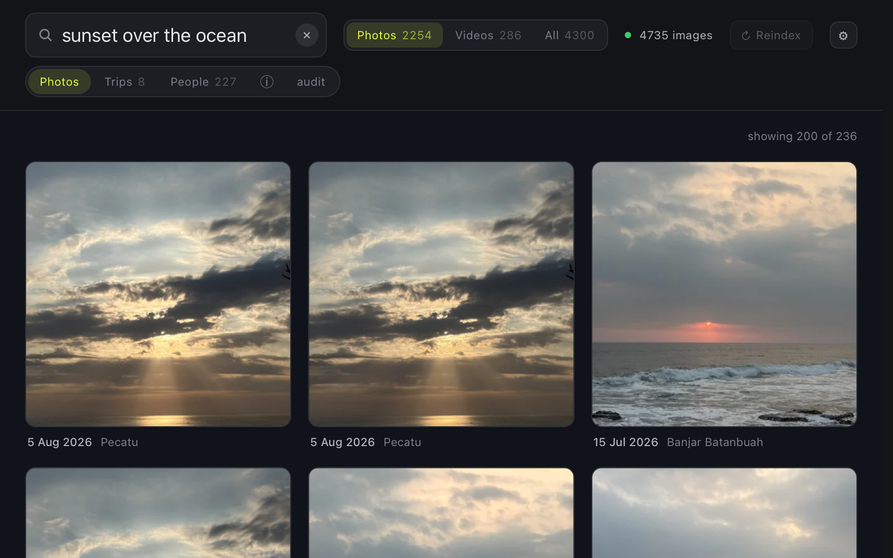

# lens



Vision search for your own photo **and video** folders. Lens indexes the files
you point it at — EXIF, offline reverse geocode, trip clustering, SigLIP 2
image embeddings and, with one extra package, the faces in them — and a
[fused-render](https://render.fused.io) view lets you search them in plain
language: `bali july 2025`, `trip last year`, `red`, `dog on a beach`,
`photos of ana`, `screen recording`. Nothing leaves the machine.

## First run

The app ships with no index, because building one is minutes of work over your
own files — something you start, never something that happens to you. A fresh
install opens on an invitation rather than an empty grid, and the way out of it
is three steps:

1. **Choose a photo folder** — from the empty state, or the ⚙ menu at any time.
   `~/Pictures`, an external drive, anything you can read; add as many as you
   like. `/` is refused and your whole home folder asks for a second press,
   because that first scan is long.
2. **Start indexing.** The scan runs in the background as a job in
   fused-render's download manager, survives navigating away, and its ✕ really
   cancels (partial progress is kept and the next run resumes). Photos become
   searchable as they land, so the grid fills in while it works.
3. **Search.**

The first index run (or the first search on an already-built catalog) downloads
the SigLIP 2 weights, ~4.6 GB, once, into fused-render's model runtime. That is
the only time lens touches the network; every later run works fully offline, and
lens never keeps a second copy of the weights.

Re-scan any time with ↻ in the header. Only new and changed files are read.

## Setup

There isn't any beyond the first run above: lens runs entirely on
fused-render's own APIs, and needs a build with the `embeddings` AI capability
(fused-render **0.4.45** or newer). The folder's Python environment builds
itself on first render — numpy, Pillow, pillow-heif, reverse_geocoder and av,
and deliberately no PyTorch, because the model is fused-render's rather than
lens's.

There is no daemon to start. The model lives in fused-render's AI runtime
(`fused.ai.embed`); the catalog and vectors live in
`~/.fused-render/cache/lens/` and are read by short per-request Python calls.
An index built under the old daemon keeps working unchanged — same model,
same vectors. (`scripts/lens.py index` still indexes from a terminal with a
local torch install, for anyone scripting outside fused-render.)

Your photo folders are only ever **read**. Everything lens produces — catalog,
thumbnails, vectors, face crops, config — is inside
`~/.fused-render/cache/lens/`; deleting that folder loses the index and nothing
else.

## Using it

`index.html` at the root of this folder is the app. Open it in fused-render —
either hand the file to the app, or visit
`http://127.0.0.1:<render-port>/explorer/view/<abs path>/index.html`
(swap `view` for `embed` to drop the chrome). Type to search; click a
photo for the lightbox; press `i` there for the full EXIF table; `←`/`→` to
move between photos, `Esc` to back out a layer. The **Photos / Videos / All**
toggle picks what a search looks at.

- **⚙ Photo folders** lists the folders lens indexes. *Add folder* browses from
  your home directory (or paste a path); ✕ removes one, which drops its photos
  from the library on the reindex that follows — the files themselves are never
  touched. A folder lens can't see right now — an unplugged drive — is marked
  `missing` and keeps its photos until you remove it deliberately. Adding or
  removing does **not** start a scan by itself — browsing folders should not
  cost minutes of work nobody asked for — so press ↻ when you are done.
- Hidden directories and the obvious noise (`node_modules`, `Library`,
  `Applications`, `System`, `venv`, `__pycache__`) are skipped, so a whole home
  directory is a workable root — lens asks for a second press before taking one
  on, since that first scan is long. `/` is refused outright.
- Point lens at **plain folders of image and video files**. A `.photoslibrary`
  bundle is
  never walked — it stores originals and derivative renders side by side, so
  walking one would show you every photo several times. Read it through the
  **Apple Photos** switch below instead.
- `↻ Reindex` in the header rescans the roots — or `scripts/lens.py reindex`.
- `scripts/lens.py index` indexes once without a daemon; `status` prints JSON.
- `?limit=N` on the view URL changes the page size (default 200); the count
  line reads `showing N of TOTAL` whenever the limit cuts the results.
- `LENS_CACHE` picks the cache directory (default
  `~/.fused-render/cache/lens`): catalog, thumbnails, embeddings, config.

## Videos

`.mp4`, `.mov`, `.m4v` and `.webm` are indexed alongside your photographs, from
the same folders, with no switch to turn on. `.mkv` and `.avi` are deliberately
left out: on a real machine those are downloaded films — hours long, tens of
gigabytes, and nobody's memories.

A video is decoded with [pyav](https://pyav.org) (which bundles its own ffmpeg,
so there is nothing to install and no subprocess). **Six frames** are sampled
evenly across the duration, embedded, and averaged into **one vector** — the same
kind of vector a photograph gets, in the same matrix, so a clip is ranked by the
same search with no special case. The middle of those six frames becomes its
thumbnail.

- **Search finds what a clip is mostly about.** Pooling six frames into one
  vector is the tradeoff: a thing that appears for one second of a five-minute
  recording is diluted by the other frames. Matching individual frames (so a
  search could point at a moment) needs a second matrix and is a later wave.
- **Photos / Videos / All.** The photographs' scope holds no videos — a grid
  where every third tile wants pressing play is not what "photos" promises — so
  videos have a scope of their own, and `All` has everything.
- **A tile** carries a ▶ glyph and its running time. Pressing it plays the file
  in place, streamed off your disk by fused-render; the poster you see first is
  the frame the grid was already showing. If your browser cannot play a
  particular codec (ffmpeg decodes far more than Chromium will play), the
  lightbox says so, keeps showing the real frame, and offers the path to open in
  your usual player.
- **When and where.** The capture time comes from the container, converted to the
  local clock it was shot at — a phone writes UTC, and left alone a clip shot at
  18:41 in India lands at 13:11 among a different evening's photographs. The GPS
  fix a phone writes into the container is read too, so a video gets place names
  and joins trips like the photographs around it. No capture time at all (a
  screen recording) falls back to the file's own timestamp.
- **The details panel** (`i`) shows duration, dimensions, frame rate, codec and
  container instead of a camera and an exposure, and the *Looks like* chips work
  on a video exactly as they do on a photograph — they are read off the same
  vector.
- **Not yet**: rotation metadata is ignored, so a portrait clip that stores its
  orientation as a display matrix (rather than as real portrait pixels) gets a
  sideways thumbnail — it still plays the right way up. Videos are also outside
  the audit's EXIF check.

## Apple Photos

Most people's photographs live in a Photos library, so lens can read one — the
**⚙ menu → Apple Photos → Turn on**. It is **off until you ask**, because the
first sync is long and macOS will want to grant permission first.

What it does: reads the library's own database (via
[osxphotos](https://github.com/RhetTbull/osxphotos)) and indexes the
**originals in place**, one catalog row per photograph, pointing at the file
inside the bundle. **Read-only** — lens never writes to the library, never
copies a photo out of it, and never changes anything in Photos.

What comes across: the capture date and location Photos holds (these win over
the file's own EXIF — a date you corrected in Photos, or a location for a photo
whose GPS tags were stripped), plus albums, title, description, favourite and
the names of people Photos recognised. Everything else — dimensions, format,
exposure, the raw EXIF dump — is read from the file itself.

- **Album names are searchable**: `bali 2025`, `photos in album wedding`. Titles
  too. The details panel (`i` in the lightbox) shows the albums, the title and a
  ★ for a favourite; pressing an album chip searches it. Person names are stored
  but not yet searchable.
- **Videos in the library are still skipped**, and counted in the panel. The
  folder walker indexes videos (see above), but a Photos movie needs its own path
  handling on top of the TCC permission, so it is deferred. Videos in ordinary
  folders are unaffected.
- **Originals stored only in iCloud** — "Optimise Mac Storage" — cannot be
  indexed: there is no file on this machine, and lens will not download one.
  They are counted in the panel as "still in iCloud". If one is offloaded after
  it was indexed, its row and thumbnail stay: the photo is still in your
  library.
- **Turning it off** removes those photos from the library on the next scan,
  exactly as removing a folder does. The files are untouched.
- **macOS permission**: reading the library needs Full Disk Access for whatever
  runs the daemon (Terminal, iTerm, your editor) — System Settings → Privacy &
  Security → Full Disk Access. Without it the panel says so and offers the fix;
  the rest of the index run carries on regardless, and nothing is pruned.

## People

After the embed pass, a **second sweep** over the same 512px thumbnails looks for
faces, and then works out which of them are the same person. It needs one extra
package (the end of this section); without it lens indexes and searches exactly
as it does with it, and the index run reports why there are no faces.

Two models, both running on this machine and neither of them ever told who
anybody is. **MTCNN** finds the faces — a box and a confidence, and nothing about
identity. **InceptionResnetV1** with vggface2 weights turns each square crop into
a 512-dimensional unit vector, so two crops of the same person land close together
and two people land apart; that distance is the whole of "recognition" here. The
detector runs on the CPU whatever else the machine has — its image pyramid needs
an adaptive pool MPS refuses at non-divisible sizes — and the embedder runs on MPS
when there is one. A video is read at its middle keyframe, the frame already
decoded for its thumbnail. Detections below `faces.MIN_PROB = 0.92` are dropped:
a false positive is not cosmetic here, it becomes a vector, and a handful of door
handles cluster together happily and arrive as a person.

The rows land in a `faces` table (photo, normalized box, confidence, cluster) and
the vectors in `cache/faces.npz`, written with the same atomic swap as
`embeddings.npz` and checkpointed every 32 photographs — a kill costs the last
few rows, never the run. `photos.faces_v` records which generation of models last
scanned a row, so changing either model or the confidence floor re-detects the
library rather than mixing two kinds of vector in one cluster.

- **Who is who is a threshold, and the threshold was measured.** Clustering is
  greedy and hand-rolled: walk the faces in a fixed order, drop each into the
  nearest cluster whose centre it is within `persons.JOIN = 0.65` of, start a new
  one when it is not, then recompute the centres and do it again. Two passes, no
  dependency — `sklearn`'s agglomerative clustering wants the whole distance
  matrix in memory (20,000 faces is a 1.6 GB triangle) and 30 MB of install for
  one function. On this library, at the size it was when the rule was settled —
  86 photographs, 67 faces, 2,211 pairs — similarity between two faces is 0.13 at
  the median and 0.49 at p90, while one person across five years, two file
  formats and a pair of sunglasses ran 0.59–1.00 (median 0.81 inside a
  hand-checked cluster of eleven). At 0.60 the largest cluster had swallowed a
  second man and a face-painted stranger; at 0.65 they stay apart; 0.70 only
  sheds a sighting. Erring high is deliberate: joining two people writes a wrong
  name onto somebody's photographs and you have to notice before you can undo it,
  while splitting one person leaves two cards you merge in one press.
- **A face seen fewer than three times belongs to nobody**
  (`persons.MIN_CLUSTER`). A stranger in the background of a street scene is not
  a card with a name field on it. Those faces are not deleted — they keep their
  row and their vector with no person against them, and a third sighting promotes
  the lot at once.
- **A person stays the same person across a re-cluster.** Clustering runs again
  after every index run and recomputes from scratch, so identity cannot live in a
  cluster label. It is carried by the centroid instead: a fresh cluster whose
  centre is within `persons.SAME_PERSON = 0.8` of a previous person *is* that
  person, and inherits their id, their name and any merge they were part of.
  Centroids barely move — removing two of one person's eleven faces moved theirs
  by 0.003, while the two closest *different* people in this library are 0.49
  apart — which is what makes a person id stable enough to put in a URL and write
  a name against. A merged person keeps their row with `merged_into` set, and it
  is that row's centroid which makes the merge outlive the next recompute (chains
  are followed, cycles guarded).
- **Names are never invented.** Either you type one, or it comes across from a
  name your Apple Photos library already holds (see above) — and then only from
  photographs with exactly one detected face and exactly one name, only once a
  cluster has agreed with itself three times, never over a name you typed, and
  never on a tie. A group shot's five names against five faces is a permutation
  problem, not a fact. Everything else stays unnamed, and unnamed is a fine
  permanent state.
- **Rename and merge are the two corrections.** A rename is trimmed and capped at
  80 characters, and an empty name clears it back to unnamed. A merge takes the
  person to keep and the person to absorb, and survives the next re-cluster by
  the centroid rule above — so it is a one-press fix, not something to redo every
  index run.
- **Searching for a person.** Once somebody has a name it is a word the query
  parser knows, so `photos of ana` means her face rather than an album called
  Ana — a person's name is matched before albums and places, because it is the
  most specific thing you can type and you typed it yourself against a face. Two
  people **narrow** rather than widen (`ana and ben` wants both of them in the
  frame), and a name composes with the rest of the vocabulary: `ana bali july
  2025`, `ana trip last year`.
- **It is all local.** Both models were downloaded once, at install time, from
  HuggingFace and GitHub. Nothing is uploaded, no identity is looked up anywhere,
  and a face crop is only ever served over the same loopback-guarded endpoint as
  the rest of the daemon.

The endpoints, all loopback-guarded like everything else:

- `GET /people` → `{"people": [{id, name, face_count, photo_count,
  cover_face_id}]}`, most photographs first. A person whose faces have all gone
  is not listed, though their row survives so their name does.
- `GET /people/<face_id>/face.webp?s=200|400` — one face, cropped out of the
  cached thumbnail. Cached by content (the photo's sha1 plus the box), so
  re-detecting a library does not invalidate every avatar.
- `GET /query?person=<id>` — that person's photographs, composing with `q`,
  `scope` and `trip`.
- `POST /people/<id>/rename` with `{"name": "Ana"}`.
- `POST /people/merge` with `{"keep": 3, "absorb": 7}`.
- `GET /meta/<id>` now carries `"people": [{face_id, person_id, name, prob,
  bbox}]` — faces with no person included, with `person_id: null`.
- `GET /status` now carries `"faces": {faces, clustered, people, named, scanned,
  eligible}`. `scanned` of `eligible` is the denominator that stops "3 people"
  reading as "you know three people"; while a run is in flight its progress
  object also carries a `stage` of `index` or `faces`.
- `GET /validate` gains a fifth check, `faces_integrity` — it holds the table and
  the npz against each other in both directions, re-norms a sample of face
  vectors, and checks that every cluster points at a live person and every person
  shows a cover face of their own. It deliberately does not score coverage: a
  sweep still in flight is a true statement about the library, not a fault.

Installing it:

```bash
pip install --no-deps facenet-pytorch
```

`--no-deps` is not a shortcut. facenet-pytorch declares pins that are two years
stale (`torch<2.3`, `numpy<2`, `Pillow<10.3`), and honouring them downgrades all
three underneath the rest of lens — pillow-heif then refuses to load and HEIC
photos stop being readable. The code itself runs fine on current torch, and every
dependency it actually needs is already one of lens's own.

## Limits, stated plainly

- **The lightbox shows a 512 px render for HEIC and for video frames.** A
  browser cannot decode a HEIC and cannot seek a movie frame on its own, and the
  app's Python runs in a short-lived subprocess with no ffmpeg — so for those
  formats the largest thing lens can honestly show is the thumbnail the index
  already made. JPEG, PNG, WebP, GIF, BMP and AVIF open at full resolution.
- **Faces need the `faces` extra.** Without `facenet-pytorch` (and the `torch`
  extra it needs), the **People** view is permanently empty and the index run
  says why. Indexing and search are unaffected.
- **Apple Photos needs the `apple` extra**, and it is macOS-only.
- **Search needs fused-render 0.4.45 or newer** — that is the release the
  `embeddings` capability landed in. On an older build the app still opens,
  browses and filters by date and place, but a semantic query is refused with a
  sentence saying so.
- **Indexing is not fast.** A thumbnail, a metadata read and a forward pass
  through a 400M-parameter tower, per file. A few thousand photos is tens of
  minutes on Apple silicon; it is incremental afterwards.
- **macOS is what this is tested on.** Nothing is deliberately
  platform-specific except the `apple` extra, but the paths, the Trash and the
  HEIC pipeline have only been exercised there.

## Troubleshooting

- **The empty state says "Search your photos by describing them"** — that is a
  fresh install, not a fault. Add a folder and press *Start indexing*.
- **"Your library isn't available"** — two things reach that screen and the
  sentence under it says which. `store damaged` means the catalog in
  `~/.fused-render/cache/lens/` could not be read; delete that folder and
  re-index. A message about dependencies means the folder's Python environment
  has not finished building — fused-render offers to install it.
- **`lens: catalog schema upgraded, full re-index required`** — the catalog
  format changed too much to patch, so it was rebuilt empty. Normal, and it
  re-indexes itself. The same happens if you change `model` in the cache's
  `config.json`: a new embedding model means every photo is re-embedded.
  (`schema extended in place` is the cheap version of the same thing: columns
  were added, nothing was lost, no re-index needed.)
- **"macOS blocked access to your Photos library"** — grant Full Disk Access to
  fused-render (System Settings → Privacy & Security), then ↻ Reindex. Nothing
  is removed from the library while it is blocked.
- **A photo or video is missing from results** — files that can't be opened are
  stored with an error and retried each run; the header banner counts them. Check
  the scope toggle too: a video is not in the photographs' scope.
- **A video will not play in the lightbox** — the browser refused the codec, not
  lens: the thumbnail beside the message was decoded from that same file. Use the
  path it offers. (Chromium plays H.264/AAC in `.mp4` and `.mov`, and VP8/VP9 in
  `.webm`; H.265/HEVC depends on the machine.)
- **No faces and no people at all** — either `facenet-pytorch` is not installed
  (the index run's `face_error` says so, and `/status` reports `faces.scanned` of
  `faces.eligible` as the sweep's progress) or the sweep has not reached those
  photographs yet. Zero people in a library nobody has swept is not the same
  claim as zero people in a library that has been swept, which is why both
  numbers are reported.
- **Somebody appears as two people** — merge them; the merge survives every later
  re-cluster. The threshold errs towards splitting for exactly this reason: the
  opposite mistake puts a name on the wrong person's photographs.
- **Model tests** are skipped by default; `LENS_MODEL_TESTS=1 .venv/bin/pytest`
  runs them against the real weights.
