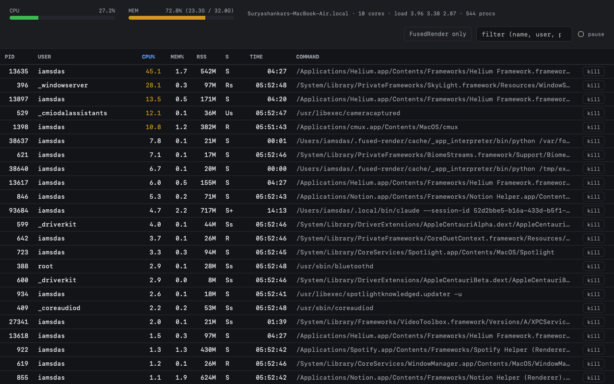

# PyTop

`top` in a browser tab. A live view of your machine: CPU and memory meters,
load average, and a sortable, filterable table of every running process —
PID, user, CPU%, MEM%, RSS, state, elapsed time and full command line.

## ⚠️ This app can terminate processes on your machine

Every row has a **kill** button. Pressing it asks Python to send `SIGTERM`
to that PID; if the process refuses, PyTop offers to send `SIGKILL` (`kill
-9`). There is also a **kill all** button that appears in *FusedRender only*
mode and terminates every FusedRender child process at once (the FusedRender
app binary itself is spared).

Concretely:

- Any PID visible in the table can be signalled — the app does not restrict
  the target to processes it started, or to a safe subset. It only ever sends
  `SIGTERM` or `SIGKILL`, never an arbitrary signal number.
- The kernel is the only guard: a kill succeeds exactly when the account
  running fused-render is allowed to signal that process. Your own processes
  are fair game; other users' and system processes fail with "permission
  denied". If fused-render is ever run as root, root's processes are killable
  too.
- Every kill is behind a `confirm()` dialog showing the PID and process name,
  and there is no undo. Killing the wrong PID can lose unsaved work or take
  down a service.

Install this only if you want that capability. It is the whole point of the
app, but it is not something you want to click around in casually.

## Using it

Open the app and it starts polling immediately — no setup, no credentials.

- **Sort** by clicking any column header (default: CPU% descending).
- **Filter** with the search box — matches command line, user, or PID.
- **FusedRender only** narrows the table to FusedRender and its descendants,
  and reveals the **kill all** button for that subtree.
- **pause** freezes the table so rows stop moving under your cursor.

The table refreshes every 3 seconds and renders the top 400 matching rows.

## Requirements

- **macOS.** `processes.py` shells out to `ps`, `sysctl -n hw.ncpu` /
  `hw.memsize` / `vm.loadavg`, `top -l 1`, `vm_stat`, `pagesize` and
  `hostname`. The flags and `vm_stat` output are macOS-specific, so the
  system meters will not populate on Linux.
- Python (`requires_python: true`) — standard library only, no pip installs.
- No network access, no API keys, no OAuth.

## Where it stores data

Nowhere. PyTop is stateless: it writes no files, no cache and no database,
in the repo or anywhere else. Everything it shows is read fresh on each
3-second poll, and the only state that persists is whatever the OS already
knew.

## Limitations

- macOS only (see Requirements).
- Only the first 400 rows after filtering and sorting are drawn.
- Memory "used" is derived from `vm_stat` free + inactive pages, so it is an
  approximation, not what Activity Monitor reports.
- Sorting `TIME` sorts the `etime` string, not the real duration, so the
  order is only roughly chronological.
- No per-core breakdown, no history, no graphs over time.
