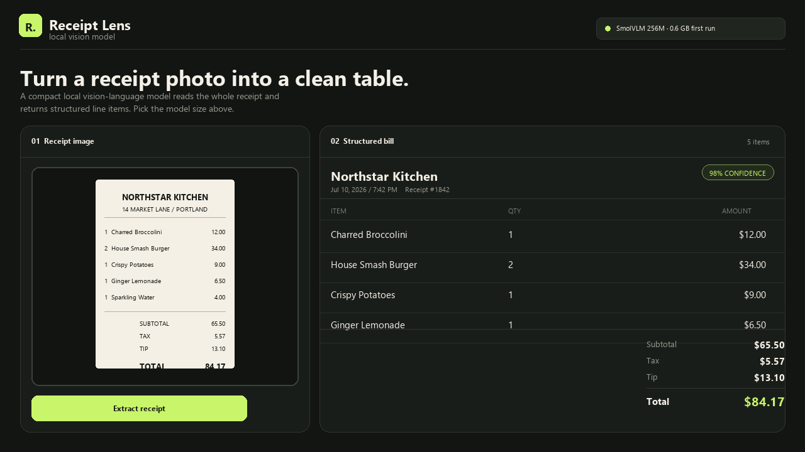

# Receipt Lens

**Turn a photo of a receipt into clean, structured data.** Drop in an image
(or load the built-in sample), pick a local vision-language model, and
Receipt Lens reads the whole document — merchant, date, receipt number,
every line item, and the totals — into an editable table you can fix up and
export.

- **Runs entirely on your machine.** No image ever leaves your computer;
  extraction happens in a local Python worker using a small vision-language
  model from Hugging Face, downloaded once and cached.
- **Pick your model.** Choose between SmolVLM 256M (fastest), SmolVLM 500M
  (balanced), SmolVLM 2.2B (most accurate), or type in any compatible
  vision-language model ID — the picker is in the header.
- **Editable results.** Every item, quantity, and amount is an input field —
  fix a misread price or add a missing item before exporting.
- **Export JSON** for the final structured receipt.

## How it works

Extraction runs as a background job (`receipt_lens.py`), spawned with
[uv](https://docs.astral.sh/uv/) so heavy dependencies (PyTorch, Transformers)
install once, in an isolated environment, only when you first extract a
receipt — the app itself needs nothing beyond the Python standard library.
The page polls the job for progress and renders the model's structured JSON
response into the table.

## Why this doesn't use `fused.ai`

fused-render's on-device model bridge (`fused.ai`, the same one behind the
AI Playground and apps like Local Chat and Local Image) currently supports
text-generation, text-to-image, transcription, and embeddings — there is no
image-input / vision-language capability yet. A vision-language model's
weights can be *downloaded* through the AI Models page, but nothing in the
runtime can send it an image and get text back.

Receipt Lens works around that the same way the original example it's based
on does: it manages its own vision model in a dedicated Python worker,
independent of `fused.ai`. That means it doesn't get the benefits other
local-ai apps get for free — shared model residency across apps, download
progress in the shell's download manager, discovery from the AI Playground,
or a common model picker fed by `fused.ai.models.catalog()`.

**This is a gap worth closing upstream.** A `vision`/`image-text-to-text`
capability in `fused.ai` — even a minimal one (an `image` option on the text
call, backed by an MLX-VLM or llama.cpp multimodal runner) — would let this
app, and any future OCR/document app, plug into the same model management,
download UX, and AI Playground discovery every other local-ai app already
has. Until then, this app is the pattern for what a vision app has to do on
its own.

## Notes

- First extraction with a given model downloads its weights (shown in the
  model picker) — this can take a few minutes depending on your connection.
- Small vision-language models can misread numbers or item names, especially
  on blurry or low-contrast photos. Always review the table before exporting.
- Requires [Astral uv](https://docs.astral.sh/uv/) on your machine to run the
  local inference worker.
