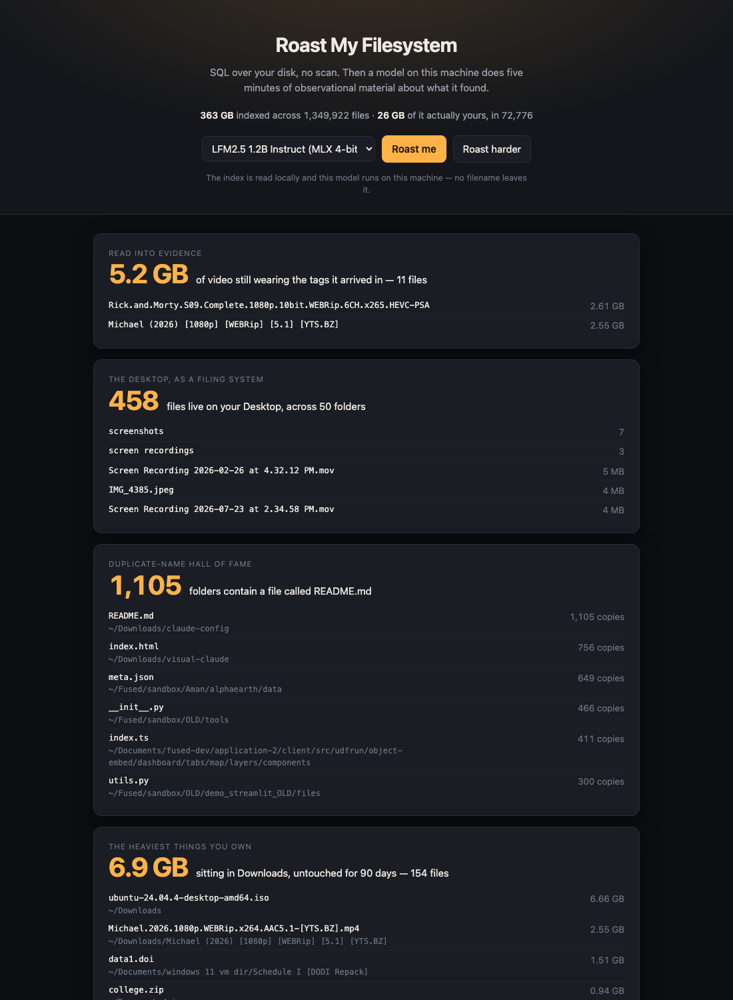

# Roast My Filesystem



**SQL over your disk, no scan. Then a model on your machine roasts you for
what it found.** Every number comes from fused-render's file index, a
parquet table a background scan already built, so the whole page answers in
milliseconds without walking a single directory.

- **Eight bits, eight queries.** Your heaviest files, media still wearing the
  scene tags it arrived in, the Desktop as a filing system, duplicate
  filenames, folders named after a feeling, archives you never opened, the
  clutter census, and a time capsule. Each is one `SELECT`, and each tile
  prints its numbers *and* the real paths behind them, so you can see for
  yourself whether the joke is fair. A bit whose query comes back empty draws
  no tile — a tidy disk gets a shorter set, not a joke about zero.
- **Every text-generation model works** — the picker is read from
  fused-render's own catalog, so it lists the curated models, anything already
  on your disk, and whatever is resident right now. Claude Haiku / Sonnet /
  Opus are offered alongside them through the Claude Code CLI, so the app works
  on a machine with no weights downloaded yet.
- **The numbers come first.** Tiles render from SQL before any model is
  touched. With no model available the page is still an honest report about your
  disk; the roast is the punchline, not the payload.
- **Roast harder** re-runs the set with nowhere to hide: one sentence per bit
  instead of two, and higher reasoning effort on the Claude path.
- Model and mode live in the URL, so a link restores the exact setup.

## What it deliberately ignores

Your index is mostly not yours. On the machine this was built against, the
index holds 1,347,915 files and 363 GB — and 72,775 files and 26 GB of that is
the user's own work. The rest is caches, app support and dependency trees.

Unscreened, the biggest number on any machine is a browser cache and every
joke lands on software nobody chose to install. So every query on this page is
screened by four clauses:

```sql
    path NOT LIKE '%/Library/%'        -- caches, app support: the 95%
AND path NOT LIKE '%/.%/%'             -- inside a dotdir: .bun, .cursor, .colima
AND path NOT LIKE '%/node_modules/%'
AND path NOT LIKE '%/site-packages/%'
```

The folder-name bit screens build output on top of that, because
`.../Index.noindex/DataStore/v5/records/V7` is Xcode doing its job, not a
personality flaw. The two totals in the header disagree on purpose, and the
smaller one is the honest one.

`node_modules` gets no joke of its own: the scanner never descends into it, so
there is no data behind one. The time capsule floors mtimes at 2000-01-01,
because files unpacked from an archive inherit the archive's dates and an
unfloored "oldest file" is a bug report rather than a joke.

## Prompting

It is a roast, so the voice is mean on purpose — aimed at the gap between the
person your files say you meant to be and what you actually did. What it will
not do is go after anything that isn't on your disk: your body, health, age,
money, or anyone else whose name turns up in a filename.

One hard rule sits above the jokes: every name, number and year in a punchline
must appear in the data handed to the model. It is told what it knows about a
file — the name, the folder, the size, the date — and told plainly that it does
not know what is *inside* one. That rule exists because it was broken during
development: the first version of the archive bit invented a whole backstory
for `college.zip` about a semester that never finished. Nothing in the data
says that, so the model is now told the filename is funnier than its guess.

Each bit then carries **its own comedic form**, because eight piles of numbers
look like the same table to a model and one generic prompt gets eight versions
of the same joke back. The duplicate-name bit is a diagnosis; the heaviest
files are a double-take between two named files; the scene tags are read into
evidence; the Desktop is a comparison; the folder names are diary entries read
aloud; the archives are a eulogy; the clutter census is an escalation; the time
capsule is a receipt. Each also carries its own word ceiling, because a joke
padded out to a limit stops being one.

The prompts are at the top of the script section in `index.html`, in plain
sight, because they are the app — everything else is plumbing around a screen
list and some strings. One thing in there is worth knowing if you edit them:
form and voice rules are restated in the *user* turn, not just the system
prompt, because on the Claude Code path a system-only "two sentences, no
headings" was ignored outright and came back as a 196-word disk-cleanup guide.

That is a discipline, not a guarantee. A small local model reads the data less
carefully than a large one, and the numbers on the tile are the record: they
came from SQL, and the joke under them did not.

## Where your data goes

Both halves are local by default: the index is read on this machine and a local
model runs on it, so no filename leaves your disk.

Pick a Claude model and that changes — the CLI path sends each bit's numbers
and sample filenames to Anthropic. The line under the picker says which of the
two you are currently in, and updates when you switch.

## Requirements

Needs a built file index — the Files tab's scan. This app never scans; it only
reads. If no index exists yet the page says so rather than showing you zeroes.

No Python, no dependencies, one HTML file.
