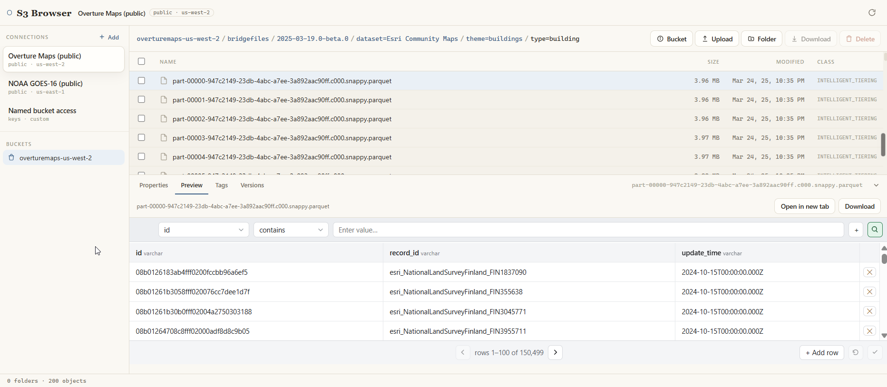

# S3 Browser

A web-based Amazon S3 client, modeled on the feature set of desktop tools like
S3 Browser / CyberDuck. Browse buckets, navigate folders, inspect objects, and
move files — against your own AWS account or any public S3-compatible store.

No build step, no server of its own, no `pip install`: it drives S3 through
`botocore`, which ships in fused-render's bundled interpreter. On first run it
seeds two public example connections (Overture Maps, NOAA GOES-16) so there's
something to click with no credentials.

## Connections

The left sidebar holds named **connections**, each its own saved identity,
editable via the **+ Add** dialog. A connection is:

| Field | Meaning |
|---|---|
| Name | Display label. |
| Auth | **Public** (anonymous), **AWS profile**, or **Access keys**. |
| Region | Blank = auto-resolved via HeadBucket. |
| Bucket | Optional — pin the connection to one bucket, or leave blank to list all. |
| Endpoint URL | Optional — for S3-compatible stores (Wasabi, MinIO, R2). |

**Credential safety:** raw access keys are stored only in fused-render's per-app
cache (`~/.fused-render/cache/s3_browser/accounts.json`) and resolved
server-side by connection id. They are **never** passed as `runPython` params,
so they never enter the call log. The page passes only the connection's id; the
active connection/bucket/prefix live in URL params so any view is bookmarkable.

## What it does

- **Browse:** bucket list + pin, folder navigation, breadcrumbs, an object
  table (size / modified / storage class), pagination, region auto-resolve,
  anonymous browsing of public AWS Open Data buckets.
- **Move files:** multi-select of files **and folders**, recursive local
  download with progress, batch/recursive delete, new folder, upload (including
  multipart for large files), rename.
- **Inspect:** the collapsible object dock — Properties + metadata, file preview
  (image / CSV / Parquet / text, via ranged reads), copy URI/key, tags view +
  edit, versions view, presigned-URL share generator with expiry, storage-class
  change, version download + restore.
- **Manage buckets:** region / versioning toggle / default encryption /
  public-access-block, a public-exposure security scan, and JSON editors for
  bucket policy / CORS / lifecycle.

## Files

| File | Role |
|---|---|
| `index.html` | The UI — connections sidebar, buckets, file table, tabbed object dock. |
| `s3.py` | The action dispatcher (`main(action=…)`). |
| `preview.py` | Object preview reader (text / CSV / Parquet / image), ranged reads. |
| `download.py` | Chunked recursive local download (`plan` / `step`), for files and folders. |
| `upload.py` | S3 multipart upload (`start` / `part` / `complete` / `abort`) for large files. |
| `s3lib.py` | Shared credential resolution, client construction, error envelope. |

## Trust

This app runs Python on your machine (`requires_python`) and talks to AWS S3
using whatever credentials you configure. It only contacts the S3 endpoints for
the connections you create; it does not phone home.
