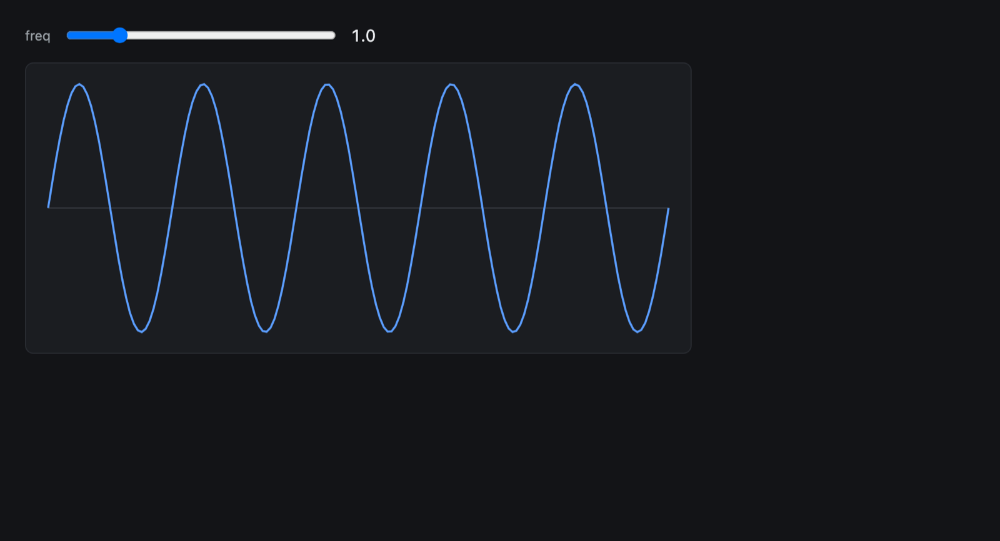

# Sine Starter

The smallest useful fused-app — a working example of the whole authoring
model in two files:

- `sine.py` — a plain Python `main(n, freq)` that returns points.
- `index.html` — a slider bound to `fused.params` (so state syncs to the
  URL) calling `fused.runPython("./sine.py", {freq})` and plotting the
  result on a canvas.

Drag the slider; refresh or bookmark the page and the exact state comes
back. Copy this folder and replace the two files to start your own app.
